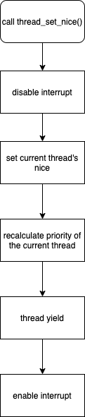
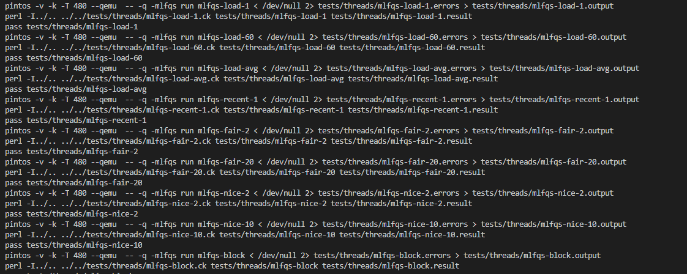

# [CSED312] OS project 1 Final Report

- 20180673 하재현
- 20180501 최진수

# Alarm Clock

## void timer_sleep

### Control flow


### Implementation

흐름도에 맞추어서 서술한다.

```c
/* List of sleeping threads */
static struct list sleep_list;

void
timer_init (void) 
{
  pit_configure_channel (0, 2, TIMER_FREQ);
  intr_register_ext (0x20, timer_interrupt, "8254 Timer");
  list_init(&sleep_list);
}
```

우선 block 된 thread들을 저장하기 위한 공간으로 sleep_list를 timer.c에 선언하였다.

그리고 `timer_init()`에서 이를 초기화하고 있다.

thread.c에서 선언할 수도 있지만, 이 경우 extern로 끌어와야 하는 등 처리할 것이 더 많아져 timer.c에 선언했다.

```c
void
timer_sleep (int64_t ticks) 
{
  int64_t start = timer_ticks ();

  ASSERT (intr_get_level () == INTR_ON);

  enum intr_level old_level = intr_disable();

  sleep_until(start + ticks);

  intr_set_level(old_level);
}
```

이전의 `timer_sleep()`는 단순히 while문을 사용해서 체크하는 방식이었다.

현재는 이 대신, 깨워야 할 시점을 명시하여 sleep_list에 보관해놓은 다음, 주기적으로 호출되는 `timer_interrupt()`에 의해 깨워지는 방식을 채택하였다.

이때 깨워야 할 시점은 `start + tick`으로 표현된다.

또한 sleep_list에 보관하는 것은 `sleep_until()`이 담당한다.

```c
void 
sleep_until(int64_t sleep_deadline_ticks)
{
  insert_sleep_list_with_deadline(sleep_deadline_ticks);
  thread_block();
}

void
insert_sleep_list_with_deadline(int64_t sleep_deadline_ticks)
{
  struct thread *current_thread = thread_current();
  current_thread->sleep_deadline_ticks = sleep_deadline_ticks;
  list_insert_ordered(&sleep_list, &current_thread->elem, tick_compare, NULL);
}

/* Form of list_less_func */ 
bool
tick_compare(const struct list_elem* a, const struct list_elem* b, void* aux)
{
  struct thread *thread_a = list_entry(a, struct thread, elem);
  struct thread *thread_b = list_entry(b, struct thread, elem);
  return thread_a->sleep_deadline_ticks < thread_b->sleep_deadline_ticks;
}
```

`sleep_until()`은 깨워야 하는 시점을 기준으로 sleep_list에 오름차순으로 집어넣는다.

`insert_sleep_list_with_deadline()`은 이 오름차순 삽입을 `list_insert_ordered()`와 `tick_compare()`를 이용해서 구현하고 있다.

이때 `tick_compare()`은 `list_less_func()`의 형태를 가지고 있으며, 더 작은 값일 때 참을 반환한다.

### Differences from design

가독성을 위해 좀 더 서술적인 이름을 사용한 것 외에 변경점은 없다.

## void timer_interrupt()

### Control flow


### Implementation

```c
static void
timer_interrupt (struct intr_frame *args UNUSED)
{
  ticks++;
  thread_wakeup();
  thread_tick ();
}
```

`timer_interrupt()`는 호출 될 때마다 sleep_list를 순회하며 깨워야 할 thread들을 깨운다.

이 깨우는 기능을 `thread_wakeup()`가 담당한다.

```c
void
thread_wakeup()
{
  while(!list_empty(&sleep_list))
  {
    if(list_entry(list_front(&sleep_list), struct thread, elem)->sleep_deadline_ticks <= ticks)
    {
      thread_unblock(list_entry(list_pop_front(&sleep_list), struct thread, elem));
    }
    else
      break;
  }
}
```

`thread_wakeup()`은 sleep_list를 순회하며 깨워져야 할 시점이 되었거나 지난 thread들을 unblock한다.

이때 sleep_list는 깨워져야 할 시간을 기준으로 오름차순 정렬되어 있으므로, 깨워야 하지 않는 thread가 발견된 순간 순회를 중단할 수 있다.

### Differences from design

이 역시 서술적인 이름을 사용한 것 이외에는 변경점은 없다.

## Screenshots


모든 test가 통과했음을 볼 수 있다.

# Priority Scheduling

## Priority scheduling

### Control flow


### Implementation

```c
void
thread_unblock (struct thread *t) 
{
  enum intr_level old_level;

  ASSERT (is_thread (t));

  old_level = intr_disable ();
  ASSERT (t->status == THREAD_BLOCKED);
  list_insert_ordered(&ready_list,  &t->elem, priority_compare, NULL);
  t->status = THREAD_READY;
  intr_set_level (old_level);
}

bool 
priority_compare(const struct list_elem* a, const struct list_elem* b, void* aux)
{
  struct thread *thread_a = list_entry(a, struct thread, elem);
  struct thread *thread_b = list_entry(b, struct thread, elem);
  return thread_a->priority > thread_b->priority;
}
```

`thread_unblock()`을 통해 ready_list에 thread를 삽입할 때 priority 순서대로 집어넣게 했다.

이때, 내림차순으로 삽입하기 위해 `priority_compare()`은 더 클 때 true를 반환하도록 했다.

```c
static void
schedule (void) 
{
  struct thread *cur = running_thread ();
  struct thread *next = next_thread_to_run ();
  struct thread *prev = NULL;

  ASSERT (intr_get_level () == INTR_OFF);
  ASSERT (cur->status != THREAD_RUNNING);
  ASSERT (is_thread (next));

  if (cur != next)
    prev = switch_threads (cur, next);
  thread_schedule_tail (prev);
}

static struct thread *
next_thread_to_run (void) 
{
  if (list_empty (&ready_list))
    return idle_thread;
  else
    return list_entry (list_pop_front (&ready_list), struct thread, elem);
}
```

내림차순으로 정렬되어 있기 때문에 간단히 `list_pop_front()`를 이용해서 다음 thread를 결정하면 된다.

```c
void
thread_set_priority (int new_priority) 
{
  if(!thread_mlfqs)
  {
    int prev_priority = thread_current ()->priority;
    thread_current ()->original_priority = new_priority;
    if(list_empty(&thread_current()->donators))
    {
      thread_current ()->priority = new_priority;
      thread_yield();
    }
  }
}
```

Priority donation의 구현이 섞어있어 알아보기 힘들지만, 핵심은 새로 지정된 priority를 기준으로 다시 scheduling을 하기 위해 `thread_yield()`를 호출하는 것이다.

### Differences from design

원래 디자인은 `thread_create()`와 `thread_set_priority()`에서 priority가 더 커지는지 혹은 작아지는지 판단하여 `thread_yield()`를 호출했다.

실제 구현은 해당 판단문들을 없앴다.

판단문 없이 그냥 `thread_yield()`를 호출해도 동작하기 때문에, 코드를 간결하게 하기 위해서이다.

## Priority donation

### Control flow


### Implementation

```c
struct thread
  {
    /* Owned by thread.c. */
    tid_t tid;                          /* Thread identifier. */
    enum thread_status status;          /* Thread state. */
    char name[16];                      /* Name (for debugging purposes). */
    uint8_t *stack;                     /* Saved stack pointer. */
    int priority;                       /* Priority. */
    struct list_elem allelem;           /* List element for all threads list. */

    /* Shared between thread.c and synch.c. */
    struct list_elem elem;              /* List element. */
    struct list_elem donate_elem;       
    int64_t sleep_deadline_ticks;
    struct lock *lock_on_wait;
    struct list donators;
    int original_priority;

#ifdef USERPROG
    /* Owned by userprog/process.c. */
    uint32_t *pagedir;                  /* Page directory. */
#endif

    /* Owned by thread.c. */
    unsigned magic;                     /* Detects stack overflow. */
  };
```

아래의 필드가 추가되었다.

- **original_priority**: 원래의 priority
- **lock_on_wait**: acquire하기를 기다리고 있는 lock
- **donators**: donation을 한 thread들의 리스트
- **donate_elem**: donators list를 위한 필드

```c
void
lock_acquire (struct lock *lock)
{
  ASSERT (lock != NULL);
  ASSERT (!intr_context ());
  ASSERT (!lock_held_by_current_thread (lock));

  if(!thread_mlfqs && lock->holder != NULL)
  {
    thread_current()->lock_on_wait = lock;
    priority_donate(lock);
  }

  sema_down (&lock->semaphore);
  lock->holder = thread_current ();
  lock->holder->lock_on_wait = NULL;
}

void 
priority_donate (struct lock* lock)
{
  ASSERT (lock != NULL);

  struct thread* donor_thread = thread_current();
  struct thread* receiver_thread = lock->holder;
  if(require_donation(donor_thread, receiver_thread)){
    list_push_front(&receiver_thread->donators, &donor_thread->donate_elem);
    priority_donate_recursive(donor_thread, receiver_thread);
  }
  lock->is_donated = true;
}

bool 
require_donation (struct thread* donor_thread, struct thread* receiver_thread)
{
  return donor_thread->priority > receiver_thread->priority;
}
```

`lock->holder`가 존재한다는 의미는 곧바로 acquire를 하지 못한다는 것이므로 우선적으로 lock_on_wait에 lock을 저장해주고, donation을 진행한다.

Donation은 간단히 donation이 필요한지 체크하고, 그렇다면 donators에 등록하고 priority inversion을 수행한다.

Priority inversion은 `priority_donate_recursive()`이 담당하는데, 이는 [Extended donation](#extended-donation)에서 자세히 설명하고 있다.

```c
void
lock_release (struct lock *lock) 
{
  ASSERT (lock != NULL);
  ASSERT (lock_held_by_current_thread (lock));
  
  if(lock->is_donated)
    priority_restore(lock);

  lock->holder = NULL;
  sema_up (&lock->semaphore);
}

void 
priority_restore (struct lock* lock)
{
  remove_donators_on_restored_lock(lock);
  if(list_empty(&thread_current()->donators))
    thread_current()->priority = thread_current()->original_priority;
  else
    thread_current()->priority = 
      list_entry(list_front(&thread_current()->donators), struct thread, donate_elem)->priority;

  lock->is_donated = false;
}

void
remove_donators_on_restored_lock (struct lock* lock)
{
  struct list_elem *elem = list_begin(&thread_current()->donators);
  struct list_elem *next = list_end (&thread_current()->donators);
  while (elem != list_end(&thread_current()->donators))
  {
    next = list_next(elem);
    if(list_entry(elem, struct thread, donate_elem)->lock_on_wait == lock){
      list_remove(elem);
    }
    elem = next;
  }
}
```

Donation이 이뤄진 lock이라면 restore 과정을 진행한다.

Restore은 두 가지 과정으로 이루어진다.

1. 해당 lock에 대한 남은 donation들을 지운다 (해당 lock에 대해 또 다시 inversion을 수행할 필요가 없으므로)
2. 다른 lock에 대한 donation이 남아있다면 priority inversion을 수행하고, 그렇지 않다면 원래의 priority로 돌아간다.

```c
void
sema_up (struct semaphore *sema) 
{
  enum intr_level old_level;

  ASSERT (sema != NULL);

  old_level = intr_disable ();
  if (!list_empty (&sema->waiters))
  {
    list_sort (&sema->waiters, priority_compare, NULL);
    thread_unblock (list_entry (list_pop_front (&sema->waiters),
                                struct thread, elem));
  }
  sema->value++;
  thread_yield();
  intr_set_level (old_level);
}

void
cond_signal (struct condition *cond, struct lock *lock UNUSED) 
{
  ASSERT (cond != NULL);
  ASSERT (lock != NULL);
  ASSERT (!intr_context ());
  ASSERT (lock_held_by_current_thread (lock));

  if (!list_empty (&cond->waiters))
  {
    list_sort (&cond->waiters, sema_priority_compare, NULL);
    sema_up (&list_entry (list_pop_front (&cond->waiters),
                          struct semaphore_elem, elem)->semaphore);
  }
}

bool 
sema_priority_compare (const struct list_elem* a, const struct list_elem* b, void* aux)
{ 
  struct semaphore_elem *sema_a = list_entry(a, struct semaphore_elem, elem);
  struct semaphore_elem *sema_b = list_entry(b, struct semaphore_elem, elem);
  return list_entry(list_front(&sema_a->semaphore.waiters), struct thread, elem)->priority > 
  list_entry(list_front(&sema_b->semaphore.waiters),struct thread, elem)->priority;
}
```

priority-condvar, priority-sema를 통과하기 위해 `list_pop_front()`를 하기 전 sorting을 해주었다.

### Differences from design

사실 구현에 착수할 당시에, thread list 보단 priority와 lock의 list가 공간적으로 효율적이라는 생각이 들어 이 방향으로 구현을 도전했었다.

그런데 여러가지 이해할 수 없는 에러가 생겨서 결국 본래의 디자인으로 회귀하게 되었다.

아래는 최종적으로 바뀐 것들이다.

1. `list_insert_ordered()` → `list_push_front()`

`lock_aquire()`에서 원래는 `list_insert_ordered()`를 사용하려고 했었다.

그러나, 어차피 donation은 현재 priority보다 커야 가능하므로 저절로 내림차순 정렬이 된다는 것을 깨달았다.

따라서 `list_push_front()`로 바꾸었다.

2. `remove_donators_on_restored_lock()` 구현

원래는 모든 donation 각각에 대해 restore을 실행해야 한다고 생각했었다.

그러나, priority-mutiple을 구현하면서 한 번 restore을 하면 해당 lock에 대해서는 더 이상 restore이 필요없다는 사실을 깨달았다.

그래서 `remove_donators_on_restored_lock()`을 추가적으로 구현하였다.

## Extended donation

### Control flow


### Implementation

```c
void 
priority_donate (struct lock* lock)
{
  ASSERT (lock != NULL);

  struct thread* donor_thread = thread_current();
  struct thread* receiver_thread = lock->holder;
  if(require_donation(donor_thread, receiver_thread)){
    list_push_front(&receiver_thread->donators, &donor_thread->donate_elem);
    priority_donate_recursive(donor_thread, receiver_thread);
  }
  lock->is_donated = true;
}

void 
priority_donate_recursive (struct thread* donor_thread, struct thread* receiver_thread)
{
  if(require_donation(donor_thread, receiver_thread)){
    receiver_thread->priority = donor_thread->priority;
    if(receiver_thread->lock_on_wait != NULL){
      priority_donate_recursive(receiver_thread, receiver_thread->lock_on_wait->holder);
    }
  }
}
```

Nested donation은 receiver가 acquire하고자 하는 lock이 있어서, 해당 lock의 holder에게도 priority inversion을 해야 할 때 일어난다.

우리는 이를 재귀함수 `priority_donate_recursive()`로 구현하였다.

`priority_donate_recursive()`는 donor에 receiver를, receiver에 lock holder를 집어넣으며 재귀를 하고, receiver의 lock_on_wait가 없는 경우에 재귀를 멈춘다.

### Differences from design

당시에 제대로 test case를 이해하지 못해 디자인 상에서는 이런 nested donation과 관련된 디자인을 하지 못했다.

## Examination and modification of priority 

### Control flow


### Implementation

```c
/* Sets the current thread's priority to NEW_PRIORITY. */
void
thread_set_priority (int new_priority) 
{
  if(!thread_mlfqs)
  {
    int prev_priority = thread_current ()->priority;
    thread_current ()->original_priority = new_priority;
    if(list_empty(&thread_current()->donators))
    {
      thread_current ()->priority = new_priority;
      thread_yield();
    }
  }
}
/* Returns the current thread's priority. */
int
thread_get_priority (void) 
{
  return thread_current ()->priority;
}
```

`thread_set_priority()`는 donation이 이뤄진 상태인지 아닌지 만을 따진다.

만약 donation이 이뤄지지 않은 상태라면 original priority만 갱신하고 yield를 하진 않는다.

Inversion priority의 지배를 받고 있으므로 yield하면 안 되기 때문이다.

반대로 donation이 이뤄진 상태라면 priority를 갱신하며 추가로 `thread_yield()`를 호출한다.

만약 priority가 작아진다면 다른 thread에게 양보하게 될 것이다.

### Differences from design

디자인 상에서는 donation 상태를 고려하지 않고 그냥 갱신 후 yield를 호출한다.

그러나 이 때문에 priority-condvar test가 통과하지 않는다는 것을 깨닫고 위와 같이 구현하게 되었다.

## Screenshots


모든 test가 통과했음을 볼 수 있다.

# Advanced Schedular

## MLFQS

### Control flow


### Implementation

우선 `fixed_point.h` 파일을 helper function의 정의를 위해 새로 만들었다.

```c
int int_to_fp(int n);
int fp_to_int_round(int x);
int fp_to_int(int x);
int add_fp(int x, int y);
int add_mixed(int x, int n);
int sub_fp(int x, int y);
int sub_mixed(int x, int n);
int mul_fp(int x, int y);
int mul_mixed(int x, int y);
int div_fp(int x, int y);
int div_mixed(int x, int n);
```

`fixed_point.h` 에는 연산을 위한 helper function들이 정의되어 있는데, 이런 과정이 필요한 이유는 pintos가 float 형식을 감지하지 못하기 때문이다. 때문에 이 assignment에서 실수를 의미하는 모든 변수는 int 자료형에서 17.14 fixed-point number representation을 이용해 표현하게 된다. 그리고 `fixed_point.h` 는 그런 변수들을 적절하게 연산하게 도와준다.

위에서 x, y는 실수를, n은 정수를 의미한다. 계산 방법은 다음과 같다.

| Convert n to  fixed point:                    | n * f                                                    |
| --------------------------------------------- | -------------------------------------------------------- |
| Convert x to  integer (rounding toward zero): | x / f                                                    |
| Convert x to  integer (rounding to nearest):  | (x + f / 2) / f if x >= 0,    (x - f / 2) / f if x <= 0. |
| Add x and y:                                  | x + y                                                    |
| Subtract y from x:                            | x - y                                                    |
| Add x and n:                                  | x + n * f                                                |
| Subtract n from x:                            | x - n * f                                                |
| Multiply x by y:                              | ((int64_t) x) * y / f                                    |
| Multiply x by n:                              | x * n                                                    |
| Divide x by y:                                | ((int64_t) x) * f / y                                    |


```c
void mlfqs_priority(struct thread* t)
{
  if(t!=idle_thread)
  {
    t->priority = PRI_MAX - fp_to_int(div_mixed(t->recent_cpu,4)) - (t->nice * 2);
    if (t->priority < PRI_MIN)
      t->priority = PRI_MIN;
    else if (t->priority > PRI_MAX)
      t->priority = PRI_MAX;
  }
}
```

`mlfqs_priority()` 함수는 priority를 업데이트 해주는 함수이다. MLFQS에서 priority 계산 공식은 다음과 같다.

`priority = PRI_MAX - (recent_cpu / 4) - (nice * 2)`

이때 `recent_cpu`, `nice`는 실수값을 가진다는 것을 유의해야 한다.

```c
void mlfqs_recent_cpu(struct thread* t)
{
  if(t!=idle_thread)
    t->recent_cpu = add_mixed(mul_fp(div_fp(mul_mixed(load_avg, 2), add_mixed(mul_mixed(load_avg, 2), 1)), t->recent_cpu), t->nice);
}
```

`mlfqs_recent_cpu()`함수는 `recent_cpu`를 계산해준다. `recent_cpu`는 다음과 같은 값을 공식을 갖는다.

`recent_cpu = (2*load_avg)/(2*load_avg + 1) * recent_cpu + nice`

```c
void mlfqs_load_avg(void)
{
  struct list_elem* e;
  size_t ready_thread_cnt = list_size(&ready_list);
  if (thread_current() != idle_thread)
    ++ready_thread_cnt;
      
  load_avg = add_fp(div_mixed(mul_mixed(load_avg, 59), 60), div_mixed(int_to_fp(ready_thread_cnt), 60));
}
```

`mlfqs_load_avg()`함수는 `load_avg`를 계산해준다. `load_avg`가 의미하는 바는 1분동안 수행 가능한 process의 평균 개수이다. 그 식은 다음과 같다.

`load_avg = (59/60) * load_avg + (1/60) * ready_threads`

여기에서 `ready_threads`가 의미하는 것은 running thread(idle thread인 경우 제외)와 ready_list 안에 들어있는 thread의 총 개수이다.

```c
void mlfqs_increment(void)
{
  if(thread_current() != idle_thread)
    thread_current()->recent_cpu=add_mixed(thread_current()->recent_cpu, 1);
}
```

`mlfqs_increment()`는 current thread의 `recent_cpu` 값을 1 증가시켜준다. 주의해야 할 점은 `recent_cpu` 값이 실수를 의미하기에 1을 단순히 더하면 안되고 (1<<14)를 더해줘야 한다는 것이다.

```c
void mlfqs_recalc(void)
{
  struct list_elem* e;
  mlfqs_load_avg();
  for(e=list_begin(&all_list); e != list_end(&all_list); e=list_next(e))
  {
    struct thread* t=list_entry(e, struct thread, allelem);
    mlfqs_recent_cpu(t);
    mlfqs_priority(t);
  }
}

```

`mlfqs_recalc()`는 전체 thread의 `recent_cpu`,`priority`, 그리고 `load_avg`를 업데이트 시켜준다. 이 함수는 뒤의 `timer_interrupt()`에서 사용된다.

```c
void mlfqs_recalc_priority(void)
{
  struct list_elem* e;
  for(e=list_begin(&all_list); e != list_end(&all_list); e=list_next(e))
  {
    struct thread* t=list_entry(e, struct thread, allelem);
    mlfqs_priority(t);
  }
}
```

`mlfqs_recalc_priority()`는 전체 thread의 priority만을 업데이트 시켜주는 역할을 한다. 이 함수는 뒤의 `timer_interrupt()`에서 사용된다.

```c
int
thread_get_nice (void) 
{
  intr_disable();
  int n=thread_current()->nice;
  intr_enable();
  return n;
}
```

`thread_get_nice ()`는 interrupt가 disable된 상태에서 수행된다. thread의 `nice`값을 반환한다.

```c
int
thread_get_load_avg (void) 
{
  intr_disable();
  int l=fp_to_int_round(mul_mixed(load_avg, 100));
  intr_enable();
  return l;
}
```

`thread_get_load_avg ()`는 interrupt가 disable된 상태에서 수행된다. `load_avg`값을 반환한다.

```c
int
thread_get_recent_cpu (void) 
{
  intr_disable();
  int r=fp_to_int_round(mul_mixed(thread_current()->recent_cpu, 100));
  intr_enable();
  return r;
}
```

`thread_get_recent_cpu ()`는 interrupt가 disable된 상태에서 수행된다. thread의 `recent_cpu`값을 반환한다.

```c
static void
timer_interrupt (struct intr_frame *args UNUSED)
{
  ticks++;
  thread_tick ();

  if(thread_mlfqs)
  {
    mlfqs_update();
  }
  
  thread_wakeup();
}
```

`timer_interrupt()` 함수는 mlfqs scheduler을 사용하고 있을 때 100 ticks마다 `mlfqs_recalc()`를 호출하고, 4초마다 `mlfqs_recalc_priority()`를 호출한다. 위의 `mlfqs_update()`의 소스코드는 아래와 같다.

```c
void mlfqs_update()
{
  mlfqs_increment();
  if(timer_ticks() % TIMER_FREQ == 0)
  {
    mlfqs_recalc();
  }
  else if(timer_ticks() % 4 ==0)
  {
    mlfqs_recalc_priority();
  }
}
```


### Differences from design

pintos에서 float 형식이 지원되지 않는 줄 모르고 처음에는 `fixed_point.h` 파일 없이 변수들 사이의 연산을 직접적으로 행하였다. 하지만 이후에 그것을 알고 `fixed_point.h` 파일에 helper function을 정의해 사용하여 문제를 해결할 수 있었다.


## Priority scheduling in MLFQS

### Control flow



### Implementation

```c
void
thread_set_nice (int nice UNUSED) 
{
  intr_disable();
  thread_current()->nice=nice;
  mlfqs_priority(thread_current());
  thread_yield();
  intr_enable();
}
```

advanced scheduler는 priority setting을 직접적으로 하지 못하지만 `thread_set_nice()` 함수를 이용한 nice setting을 통해 간접적으로 priority setting을 할 수 있다. nice setting 이후에는 해당 thread의 priority를 재계산하고 `thread_yield()` 함수를 이용해 scheduling을 진행하게 된다.


### Differences from design

기존 design에는 nice 값 설정 이후 scheduling을 진행하지 않았다. 하지만 실제 구현을 해보니 nice set 이후에 새로운 priority로 인한 scheduling이 필요함을 알게 되어 `thread_yield()`를 nice set 이후에 진행하였다.


## Screenshots



모든 test가 통과했음을 볼 수 있다.