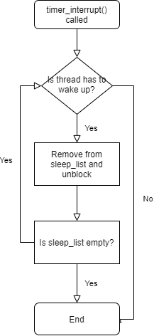

# [CSED312] OS project 1 Final Report

- 20180673 하재현
- 20180501 최진수

# Alarm Clock

## void timer_sleep

### Control flow


### Implementation

흐름도에 맞추어서 서술한다.

```c
/* List of sleeping threads */
static struct list sleep_list;

void
timer_init (void) 
{
  pit_configure_channel (0, 2, TIMER_FREQ);
  intr_register_ext (0x20, timer_interrupt, "8254 Timer");
  list_init(&sleep_list);
}
```

우선 block 된 thread들을 저장하기 위한 공간으로 sleep_list를 timer.c에 선언하였다.

그리고 `timer_init()`에서 이를 초기화하고 있다.

thread.c에서 선언할 수도 있지만, 이 경우 extern로 끌어와야 하는 등 처리할 것이 더 많아져 timer.c에 선언했다.

```c
void
timer_sleep (int64_t ticks) 
{
  int64_t start = timer_ticks ();

  ASSERT (intr_get_level () == INTR_ON);

  enum intr_level old_level = intr_disable();

  sleep_until(start + ticks);

  intr_set_level(old_level);
}
```

이전의 `timer_sleep()`는 단순히 while문을 사용해서 체크하는 방식이었다.

현재는 이 대신, 깨워야 할 시점을 명시하여 sleep_list에 보관해놓은 다음, 주기적으로 호출되는 `timer_interrupt()`에 의해 깨워지는 방식을 채택하였다.

이때 깨워야 할 시점은 `start + tick`으로 표현된다.

또한 sleep_list에 보관하는 것은 `sleep_until()`이 담당한다.

```c
void 
sleep_until(int64_t sleep_deadline_ticks)
{
  insert_sleep_list_with_deadline(sleep_deadline_ticks);
  thread_block();
}

void
insert_sleep_list_with_deadline(int64_t sleep_deadline_ticks)
{
  struct thread *current_thread = thread_current();
  current_thread->sleep_deadline_ticks = sleep_deadline_ticks;
  list_insert_ordered(&sleep_list, &current_thread->elem, tick_compare, NULL);
}

/* Form of list_less_func */ 
bool
tick_compare(const struct list_elem* a, const struct list_elem* b, void* aux)
{
  struct thread *thread_a = list_entry(a, struct thread, elem);
  struct thread *thread_b = list_entry(b, struct thread, elem);
  return thread_a->sleep_deadline_ticks < thread_b->sleep_deadline_ticks;
}
```

`sleep_until()`은 깨워야 하는 시점을 기준으로 sleep_list에 오름차순으로 집어넣는다.

`insert_sleep_list_with_deadline()`은 이 오름차순 삽입을 `list_insert_ordered()`와 `tick_compare()`를 이용해서 구현하고 있다.

이때 `tick_compare()`은 `list_less_func()`의 형태를 가지고 있으며, 더 작은 값일 때 참을 반환한다.

### Differences from design

가독성을 위해 좀 더 서술적인 이름을 사용한 것 외에 변경점은 없다.

## void timer_interrupt()

### Control flow



### Implementation

```c
static void
timer_interrupt (struct intr_frame *args UNUSED)
{
  ticks++;
  thread_wakeup();
  thread_tick ();
}
```

`timer_interrupt()`는 호출 될 때마다 sleep_list를 순회하며 깨워야 할 thread들을 깨운다.

이 깨우는 기능을 `thread_wakeup()`가 담당한다.

```c
void
thread_wakeup()
{
  while(!list_empty(&sleep_list))
  {
    if(list_entry(list_front(&sleep_list), struct thread, elem)->sleep_deadline_ticks <= ticks)
    {
      thread_unblock(list_entry(list_pop_front(&sleep_list), struct thread, elem));
    }
    else
      break;
  }
}
```

`thread_wakeup()`은 sleep_list를 순회하며 깨워져야 할 시점이 되었거나 지난 thread들을 unblock한다.

이때 sleep_list는 깨워져야 할 시간을 기준으로 오름차순 정렬되어 있으므로, 깨워야 하지 않는 thread가 발견된 순간 순회를 중단할 수 있다.

### Differences from design

이 역시 서술적인 이름을 사용한 것 이외에는 변경점은 없다.

## Screenshots

# Priority Scheduling

## Priority scheduling

### Control flow

### Implementation

### Differences from design

## Priority donation

### Control flow

### Implementation

### Differences from design

## Extended donation

### Control flow

### Implementation

### Differences from design

## Examination and modification of priority 

### Control flow

### Implementation

### Differences from design

## Screenshots

# Advanced Schedular

## MLFQS

### Control flow

### Implementation

### Differences from design

## Priority scheduling in MLFQS

### Control flow

### Implementation

### Differences from design

## Screenshots
