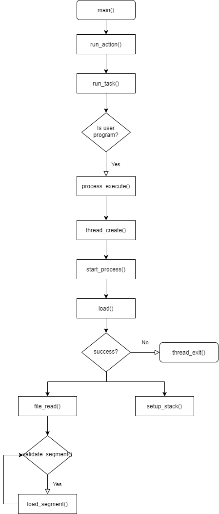
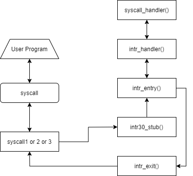

# [CSED312] OS project 2 Design Report

- 20180673 하재현
- 20180501 최진수

# Analysis on current Pintos system

## 1. Process Execution Procedure

### 1. Diagram



### 2. Explanation

```c
/* Pintos main program. */
int
main (void)
{
  char **argv;

  /* Clear BSS. */  
  bss_init ();

  /* Break command line into arguments and parse options. */
  argv = read_command_line ();
  argv = parse_options (argv);

  /* Initialize ourselves as a thread so we can use locks,
     then enable console locking. */
  thread_init ();
  console_init ();  

  /* Greet user. */
  printf ("Pintos booting with %'"PRIu32" kB RAM...\n",
          init_ram_pages * PGSIZE / 1024);

  /* Initialize memory system. */
  palloc_init (user_page_limit);
  malloc_init ();
  paging_init ();

  /* Segmentation. */
#ifdef USERPROG
  tss_init ();
  gdt_init ();
#endif

  /* Initialize interrupt handlers. */
  intr_init ();
  timer_init ();
  kbd_init ();
  input_init ();
#ifdef USERPROG
  exception_init ();
  syscall_init ();
#endif

  ...

  printf ("Boot complete.\n");
  
  /* Run actions specified on kernel command line. */
  run_actions (argv);

  /* Finish up. */
  shutdown ();
  thread_exit ();
}
```

일부분 생략한 `main()`의 코드이다.

흐름은 다음과 같다.

1. BSS 초기화
2. Command line argument 받아와서 파싱하기
3. thread 초기화
4. [메모리 초기화](#메모리-초기화) (`palloc_init`, `malloc_init`, `paging_init`)
5. tss (Task-State Segment), gdt(Globa Descriptor Table) 초기화
6. [Interrupt 초기화](#interrupt-초기화)
7. [Exception / Syscall 초기화](#exception--syscall-초기화)
8. [Run action](#run-action)

이 중 필요한 부분만 서술하겠다.

#### 메모리 초기화

```c
void
palloc_init (size_t user_page_limit)
{
  /* Free memory starts at 1 MB and runs to the end of RAM. */
  uint8_t *free_start = ptov (1024 * 1024);
  uint8_t *free_end = ptov (init_ram_pages * PGSIZE);
  size_t free_pages = (free_end - free_start) / PGSIZE;
  size_t user_pages = free_pages / 2;
  size_t kernel_pages;
  if (user_pages > user_page_limit)
    user_pages = user_page_limit;
  kernel_pages = free_pages - user_pages;

  /* Give half of memory to kernel, half to user. */
  init_pool (&kernel_pool, free_start, kernel_pages, "kernel pool");
  init_pool (&user_pool, free_start + kernel_pages * PGSIZE,
             user_pages, "user pool");
}
```

`palloc_init`는 동적 메모리 할당 영역의 초기화를 하는 함수이다.

이 함수가 실행되고 나면 `free_start` 부터 시작해서 `kernel_pages`만큼 kernel pool 이 할당되고,

`free_start+kernel_pages` 부터 `user_pages`만큼 user pool이 할당된다.

이때 `user_pages`가 `free_pages`의 절반 정도가 된다.

#### Interrupt 초기화

```c
void
intr_init (void)
{
  uint64_t idtr_operand;
  int i;

  /* Initialize interrupt controller. */
  pic_init ();

  /* Initialize IDT. */
  for (i = 0; i < INTR_CNT; i++)
    idt[i] = make_intr_gate (intr_stubs[i], 0);

  /* Load IDT register.
     See [IA32-v2a] "LIDT" and [IA32-v3a] 5.10 "Interrupt
     Descriptor Table (IDT)". */
  idtr_operand = make_idtr_operand (sizeof idt - 1, idt);
  asm volatile ("lidt %0" : : "m" (idtr_operand));

  /* Initialize intr_names. */
  for (i = 0; i < INTR_CNT; i++)
    intr_names[i] = "unknown";
  intr_names[0] = "#DE Divide Error";
  ...
  intr_names[19] = "#XF SIMD Floating-Point Exception";
}
```

`intr_init`는 interrupt의 초기화를 담당한다.

이때, interrupt의 초기화란 IDT(Interrupt Descriptor Table)의 초기화를 의미한다.

초기화는 다음의 과정으로 이루어진다.

1. pic(Programmable Interrupt Controller) 초기화
2. IDT 초기화
3. IDTR 등록
4. Interrupt 이름 초기화 및 등록

#### Exception / Syscall 초기화

```c
void
exception_init (void) 
{
  /* These exceptions can be raised explicitly by a user program,
     e.g. via the INT, INT3, INTO, and BOUND instructions.  Thus,
     we set DPL==3, meaning that user programs are allowed to
     invoke them via these instructions. */
  intr_register_int (3, 3, INTR_ON, kill, "#BP Breakpoint Exception");
  intr_register_int (4, 3, INTR_ON, kill, "#OF Overflow Exception");
  intr_register_int (5, 3, INTR_ON, kill,
                     "#BR BOUND Range Exceeded Exception");

  /* These exceptions have DPL==0, preventing user processes from
     invoking them via the INT instruction.  They can still be
     caused indirectly, e.g. #DE can be caused by dividing by
     0.  */
  intr_register_int (0, 0, INTR_ON, kill, "#DE Divide Error");
  intr_register_int (1, 0, INTR_ON, kill, "#DB Debug Exception");
  intr_register_int (6, 0, INTR_ON, kill, "#UD Invalid Opcode Exception");
  intr_register_int (7, 0, INTR_ON, kill,
                     "#NM Device Not Available Exception");
  intr_register_int (11, 0, INTR_ON, kill, "#NP Segment Not Present");
  intr_register_int (12, 0, INTR_ON, kill, "#SS Stack Fault Exception");
  intr_register_int (13, 0, INTR_ON, kill, "#GP General Protection Exception");
  intr_register_int (16, 0, INTR_ON, kill, "#MF x87 FPU Floating-Point Error");
  intr_register_int (19, 0, INTR_ON, kill,
                     "#XF SIMD Floating-Point Exception");

  /* Most exceptions can be handled with interrupts turned on.
     We need to disable interrupts for page faults because the
     fault address is stored in CR2 and needs to be preserved. */
  intr_register_int (14, 0, INTR_OFF, page_fault, "#PF Page-Fault Exception");
}

void
syscall_init (void) 
{
  intr_register_int (0x30, 3, INTR_ON, syscall_handler, "syscall");
}

static void
syscall_handler (struct intr_frame *f UNUSED) 
{
  printf ("system call!\n");
  thread_exit ();
}

void
intr_register_int (uint8_t vec_no, int dpl, enum intr_level level,
                   intr_handler_func *handler, const char *name)
{
  ASSERT (vec_no < 0x20 || vec_no > 0x2f);
  register_handler (vec_no, dpl, level, handler, name);
}
```

Exception과 Syscall의 초기화는 interrupt handler 등록을 의미한다.

아때 handler 등록은 `intr_register_int`를 통해 이뤄진다.

`exception_init()`는 이전에 `intr_init()`에서 작성해두었던 `0x00`~`0x13`까지의 interrupt를 handler와 연결한다.

이때 연결되는 함수는 `kill`이다.

`syscall_init()`는 system call interrupt의 handler를 등록한다.

이 system call handler는 `0x30`에 등록되고, 단순히 `system call!`을 출력하고 끝난다.

#### Run action

```c
static void
run_actions (char **argv) 
{
  /* An action. */
  struct action 
    {
      char *name;                       /* Action name. */
      int argc;                         /* # of args, including action name. */
      void (*function) (char **argv);   /* Function to execute action. */
    };

  /* Table of supported actions. */
  static const struct action actions[] = 
    {
      {"run", 2, run_task},
#ifdef FILESYS
      {"ls", 1, fsutil_ls},
      {"cat", 2, fsutil_cat},
      {"rm", 2, fsutil_rm},
      {"extract", 1, fsutil_extract},
      {"append", 2, fsutil_append},
#endif
      {NULL, 0, NULL},
    };

  while (*argv != NULL)
    {
      const struct action *a;
      int i;

      /* Find action name. */
      for (a = actions; ; a++)
        if (a->name == NULL)
          PANIC ("unknown action `%s' (use -h for help)", *argv);
        else if (!strcmp (*argv, a->name))
          break;

      /* Check for required arguments. */
      for (i = 1; i < a->argc; i++)
        if (argv[i] == NULL)
          PANIC ("action `%s' requires %d argument(s)", *argv, a->argc - 1);

      /* Invoke action and advance. */
      a->function (argv);
      argv += a->argc;
    }
  
}

/* Runs the task specified in ARGV[1]. */
static void
run_task (char **argv)
{
  const char *task = argv[1];
  
  printf ("Executing '%s':\n", task);
#ifdef USERPROG
  process_wait (process_execute (task));
#else
  run_test (task);
#endif
  printf ("Execution of '%s' complete.\n", task);
}
```

`run_action`은 전달받은 프로그램을 실행하는 함수이다.

신경써야 할 부분은 `{"run", 2, run_task}`이다.

`run_task()`함수를 보면, 유저 프로그램인 경우 `process_wait (process_execute (task))`를 실행하도록 되어있다.

현재 `process_wait()`은 단순히 `-1`을 반환한다.

```c
tid_t
process_execute (const char *file_name) 
{
  char *fn_copy;
  tid_t tid;

  /* Make a copy of FILE_NAME.
     Otherwise there's a race between the caller and load(). */
  fn_copy = palloc_get_page (0);
  if (fn_copy == NULL)
    return TID_ERROR;
  strlcpy (fn_copy, file_name, PGSIZE);

  /* Create a new thread to execute FILE_NAME. */
  tid = thread_create (file_name, PRI_DEFAULT, start_process, fn_copy);
  if (tid == TID_ERROR)
    palloc_free_page (fn_copy); 
  return tid;
}
```

`process_execute()`는 유저 프로그램을 실행하는 함수이다.

현재는 단순하게 전체 파일 이름을 `thread_create()`에 넘겨 thread를 생성하고 있다.

```c
static void
start_process (void *file_name_)
{
  char *file_name = file_name_;
  struct intr_frame if_;
  bool success;

  /* Initialize interrupt frame and load executable. */
  memset (&if_, 0, sizeof if_);
  if_.gs = if_.fs = if_.es = if_.ds = if_.ss = SEL_UDSEG;
  if_.cs = SEL_UCSEG;
  if_.eflags = FLAG_IF | FLAG_MBS;
  success = load (file_name, &if_.eip, &if_.esp);

  /* If load failed, quit. */
  palloc_free_page (file_name);
  if (!success) 
    thread_exit ();

  /* Start the user process by simulating a return from an
     interrupt, implemented by intr_exit (in
     threads/intr-stubs.S).  Because intr_exit takes all of its
     arguments on the stack in the form of a `struct intr_frame',
     we just point the stack pointer (%esp) to our stack frame
     and jump to it. */
  asm volatile ("movl %0, %%esp; jmp intr_exit" : : "g" (&if_) : "memory");
  NOT_REACHED ();
}
```

이때, thread가 실행하게 되는 `start_process()`는 프로그램을 메모리에 로드한 후, `intr_exit`로 점프한다.

```c
bool
load (const char *file_name, void (**eip) (void), void **esp) 
{
  struct thread *t = thread_current ();
  struct Elf32_Ehdr ehdr;
  struct file *file = NULL;
  off_t file_ofs;
  bool success = false;
  int i;

  /* Allocate and activate page directory. */
  t->pagedir = pagedir_create ();
  if (t->pagedir == NULL) 
    goto done;
  process_activate ();

  /* Open executable file. */
  file = filesys_open (file_name);
  if (file == NULL) 
    {
      printf ("load: %s: open failed\n", file_name);
      goto done; 
    }

  /* Read and verify executable header. */
  if (file_read (file, &ehdr, sizeof ehdr) != sizeof ehdr
      || memcmp (ehdr.e_ident, "\177ELF\1\1\1", 7)
      || ehdr.e_type != 2
      || ehdr.e_machine != 3
      || ehdr.e_version != 1
      || ehdr.e_phentsize != sizeof (struct Elf32_Phdr)
      || ehdr.e_phnum > 1024) 
    {
      printf ("load: %s: error loading executable\n", file_name);
      goto done; 
    }

  /* Read program headers. */
  file_ofs = ehdr.e_phoff;
  for (i = 0; i < ehdr.e_phnum; i++) 
    {
      if (file_read (file, &phdr, sizeof phdr) != sizeof phdr)
        ...
          if (validate_segment (&phdr, file))
            ...
              if (!load_segment (file, file_page, (void *) mem_page,
                                 read_bytes, zero_bytes, writable))
                                 ...

  /* Set up stack. */
  if (!setup_stack (esp))
  ...
}
```

프로그램을 메모리에 로드하는 역할은 `load()`가 담당한다.

`load()`는 파일을 열고, ELF 헤더 정보와 각 세그먼트를 메모리로 읽어들인다.

그리고 마지막에 `setup_stack()`을 호출하여 스택을 생성 및 초기화 하고 있다.

### 3. Problems

- `process_wait()`이 아무 동작도 하고 있지 않다. 

- `process_execute()`가 argument passing을 지원하고 있지 않다.

## 2. System Call Procedure

### 1. Diagram



### 2. Explanation

유저 프로그램은 `examples/`에 정의되어있다.

예시로 `examples/halt.c`를 보자

```c
#include <syscall.h>

int
main (void)
{
  halt ();
  /* not reached */
}
```

`halt.c`는 `halt` syscall을 호출하고 있다.

```c
void
halt (void) 
{
  syscall0 (SYS_HALT);
  NOT_REACHED ();
}
```

`halt()`는 `syscall0`함수에 halt의 번호를 전달해줘서 system call을 발생시키고 있다.

```c
/* Invokes syscall NUMBER, passing no arguments, and returns the
   return value as an `int'. */
#define syscall0(NUMBER)                                        \
        ({                                                      \
          int retval;                                           \
          asm volatile                                          \
            ("pushl %[number]; int $0x30; addl $4, %%esp"       \
               : "=a" (retval)                                  \
               : [number] "i" (NUMBER)                          \
               : "memory");                                     \
          retval;                                               \
        })

/* Invokes syscall NUMBER, passing argument ARG0, and returns the
   return value as an `int'. */
#define syscall1(NUMBER, ARG0)                                           \
        ({                                                               \
          int retval;                                                    \
          asm volatile                                                   \
            ("pushl %[arg0]; pushl %[number]; int $0x30; addl $8, %%esp" \
               : "=a" (retval)                                           \
               : [number] "i" (NUMBER),                                  \
                 [arg0] "g" (ARG0)                                       \
               : "memory");                                              \
          retval;                                                        \
        })

/* Invokes syscall NUMBER, passing arguments ARG0 and ARG1, and
   returns the return value as an `int'. */
#define syscall2(NUMBER, ARG0, ARG1)                            \
        ({                                                      \
          int retval;                                           \
          asm volatile                                          \
            ("pushl %[arg1]; pushl %[arg0]; "                   \
             "pushl %[number]; int $0x30; addl $12, %%esp"      \
               : "=a" (retval)                                  \
               : [number] "i" (NUMBER),                         \
                 [arg0] "r" (ARG0),                             \
                 [arg1] "r" (ARG1)                              \
               : "memory");                                     \
          retval;                                               \
        })

/* Invokes syscall NUMBER, passing arguments ARG0, ARG1, and
   ARG2, and returns the return value as an `int'. */
#define syscall3(NUMBER, ARG0, ARG1, ARG2)                      \
        ({                                                      \
          int retval;                                           \
          asm volatile                                          \
            ("pushl %[arg2]; pushl %[arg1]; pushl %[arg0]; "    \
             "pushl %[number]; int $0x30; addl $16, %%esp"      \
               : "=a" (retval)                                  \
               : [number] "i" (NUMBER),                         \
                 [arg0] "r" (ARG0),                             \
                 [arg1] "r" (ARG1),                             \
                 [arg2] "r" (ARG2)                              \
               : "memory");                                     \
          retval;                                               \
        })
```

`syscall0` 함수는 0개의 인자를 받아 system call을 호출하는 함수이다.

이와 유사한 `syscall1`,`syscall2`,`syscall3`들은 각각 1개, 2개, 3개의 인자를 받아 system call을 호출한다.

각 함수들은 `int $0x30`를 통해 system call interrupt를 발생시킨다.

이때 `0x30`인 이유는 `syscall_init()`에서 `0x30`에 등록했기 때문이다. [참조](#exception--syscall-초기화)

Interrupt는 `intr_stub`와 `intr_entry`를 거쳐 `intr_handler()`에 전달된다.

```c
void
intr_handler (struct intr_frame *frame) 
{
  bool external;
  intr_handler_func *handler;

  /* External interrupts are special.
     We only handle one at a time (so interrupts must be off)
     and they need to be acknowledged on the PIC (see below).
     An external interrupt handler cannot sleep. */
  external = frame->vec_no >= 0x20 && frame->vec_no < 0x30;
  if (external) 
    {
      ASSERT (intr_get_level () == INTR_OFF);
      ASSERT (!intr_context ());

      in_external_intr = true;
      yield_on_return = false;
    }

  /* Invoke the interrupt's handler. */
  handler = intr_handlers[frame->vec_no];
  if (handler != NULL)
    handler (frame);
  else if (frame->vec_no == 0x27 || frame->vec_no == 0x2f)
    {
      /* There is no handler, but this interrupt can trigger
         spuriously due to a hardware fault or hardware race
         condition.  Ignore it. */
    }
  else
    unexpected_interrupt (frame);

  /* Complete the processing of an external interrupt. */
  if (external) 
    {
      ASSERT (intr_get_level () == INTR_OFF);
      ASSERT (intr_context ());

      in_external_intr = false;
      pic_end_of_interrupt (frame->vec_no); 

      if (yield_on_return) 
        thread_yield (); 
    }
}
```

`intr_handler()`는 `handler = intr_handlers[frame->vec_no]`를 통해 system call handler를 불러오고, 이를 실행한다.

```c
static void
syscall_handler (struct intr_frame *f UNUSED) 
{
  printf ("system call!\n");
  thread_exit ();
}
```

현재 `syscall_handler()`는 단순히 `system call!`를 출력하고 종료된다.

### 3. Problems

- `syscall_handler()`가 아무 동작도 하지 않는다.

## 3. File System

### 1. Diagram

### 2. Explanation

### 3. Problems

// 이거 하셈

# Solutions for each requirements

## 1. Process Termination Messages

### 1. Diagram

### 2. Data Structure

### 3. Create

### 4. Change

### 5. Algorithm

## 2. Argument Passing

### 1. Diagram

### 2. Data Structure

### 3. Create

### 4. Change

### 5. Algorithm

## 3. System Call

### 1. Diagram

### 2. Data Structure

### 3. Create

### 4. Change

### 5. Algorithm

## 4. Denying Writes to Executables

### 1. Diagram

### 2. Data Structure

### 3. Create

### 4. Change

### 5. Algorithm

// 이거 하셈