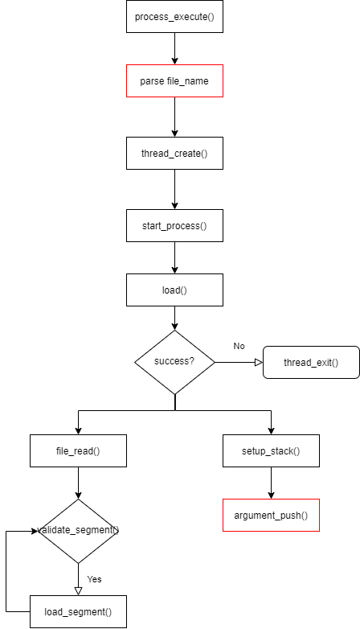

# [CSED312] OS project 2 Design Report

- 20180673 하재현
- 20180501 최진수

# Analysis on current Pintos system

## 1. Process Execution Procedure

### 1. Diagram


### 2. Explanation

```c
/* Pintos main program. */
int
main (void)
{
  char **argv;

  /* Clear BSS. */  
  bss_init ();

  /* Break command line into arguments and parse options. */
  argv = read_command_line ();
  argv = parse_options (argv);

  /* Initialize ourselves as a thread so we can use locks,
     then enable console locking. */
  thread_init ();
  console_init ();  

  /* Greet user. */
  printf ("Pintos booting with %'"PRIu32" kB RAM...\n",
          init_ram_pages * PGSIZE / 1024);

  /* Initialize memory system. */
  palloc_init (user_page_limit);
  malloc_init ();
  paging_init ();

  /* Segmentation. */
#ifdef USERPROG
  tss_init ();
  gdt_init ();
#endif

  /* Initialize interrupt handlers. */
  intr_init ();
  timer_init ();
  kbd_init ();
  input_init ();
#ifdef USERPROG
  exception_init ();
  syscall_init ();
#endif

  ...

  printf ("Boot complete.\n");
  
  /* Run actions specified on kernel command line. */
  run_actions (argv);

  /* Finish up. */
  shutdown ();
  thread_exit ();
}
```

일부분 생략한 `main()`의 코드이다.

흐름은 다음과 같다.

1. BSS 초기화
2. Command line argument 받아와서 파싱하기
3. thread 초기화
4. [메모리 초기화](#메모리-초기화) (`palloc_init`, `malloc_init`, `paging_init`)
5. tss (Task-State Segment), gdt(Globa Descriptor Table) 초기화
6. [Interrupt 초기화](#interrupt-초기화)
7. [Exception / Syscall 초기화](#exception--syscall-초기화)
8. [Run action](#run-action)

이 중 필요한 부분만 서술하겠다.

#### 메모리 초기화

```c
void
palloc_init (size_t user_page_limit)
{
  /* Free memory starts at 1 MB and runs to the end of RAM. */
  uint8_t *free_start = ptov (1024 * 1024);
  uint8_t *free_end = ptov (init_ram_pages * PGSIZE);
  size_t free_pages = (free_end - free_start) / PGSIZE;
  size_t user_pages = free_pages / 2;
  size_t kernel_pages;
  if (user_pages > user_page_limit)
    user_pages = user_page_limit;
  kernel_pages = free_pages - user_pages;

  /* Give half of memory to kernel, half to user. */
  init_pool (&kernel_pool, free_start, kernel_pages, "kernel pool");
  init_pool (&user_pool, free_start + kernel_pages * PGSIZE,
             user_pages, "user pool");
}
```

`palloc_init`는 동적 메모리 할당 영역의 초기화를 하는 함수이다.

이 함수가 실행되고 나면 `free_start` 부터 시작해서 `kernel_pages`만큼 kernel pool 이 할당되고,

`free_start+kernel_pages` 부터 `user_pages`만큼 user pool이 할당된다.

이때 `user_pages`가 `free_pages`의 절반 정도가 된다.

#### Interrupt 초기화

```c
void
intr_init (void)
{
  uint64_t idtr_operand;
  int i;

  /* Initialize interrupt controller. */
  pic_init ();

  /* Initialize IDT. */
  for (i = 0; i < INTR_CNT; i++)
    idt[i] = make_intr_gate (intr_stubs[i], 0);

  /* Load IDT register.
     See [IA32-v2a] "LIDT" and [IA32-v3a] 5.10 "Interrupt
     Descriptor Table (IDT)". */
  idtr_operand = make_idtr_operand (sizeof idt - 1, idt);
  asm volatile ("lidt %0" : : "m" (idtr_operand));

  /* Initialize intr_names. */
  for (i = 0; i < INTR_CNT; i++)
    intr_names[i] = "unknown";
  intr_names[0] = "#DE Divide Error";
  ...
  intr_names[19] = "#XF SIMD Floating-Point Exception";
}
```

`intr_init`는 interrupt의 초기화를 담당한다.

이때, interrupt의 초기화란 IDT(Interrupt Descriptor Table)의 초기화를 의미한다.

초기화는 다음의 과정으로 이루어진다.

1. pic(Programmable Interrupt Controller) 초기화
2. IDT 초기화
3. IDTR 등록
4. Interrupt 이름 초기화 및 등록

#### Exception / Syscall 초기화

```c
void
exception_init (void) 
{
  /* These exceptions can be raised explicitly by a user program,
     e.g. via the INT, INT3, INTO, and BOUND instructions.  Thus,
     we set DPL==3, meaning that user programs are allowed to
     invoke them via these instructions. */
  intr_register_int (3, 3, INTR_ON, kill, "#BP Breakpoint Exception");
  intr_register_int (4, 3, INTR_ON, kill, "#OF Overflow Exception");
  intr_register_int (5, 3, INTR_ON, kill,
                     "#BR BOUND Range Exceeded Exception");

  /* These exceptions have DPL==0, preventing user processes from
     invoking them via the INT instruction.  They can still be
     caused indirectly, e.g. #DE can be caused by dividing by
     0.  */
  intr_register_int (0, 0, INTR_ON, kill, "#DE Divide Error");
  intr_register_int (1, 0, INTR_ON, kill, "#DB Debug Exception");
  intr_register_int (6, 0, INTR_ON, kill, "#UD Invalid Opcode Exception");
  intr_register_int (7, 0, INTR_ON, kill,
                     "#NM Device Not Available Exception");
  intr_register_int (11, 0, INTR_ON, kill, "#NP Segment Not Present");
  intr_register_int (12, 0, INTR_ON, kill, "#SS Stack Fault Exception");
  intr_register_int (13, 0, INTR_ON, kill, "#GP General Protection Exception");
  intr_register_int (16, 0, INTR_ON, kill, "#MF x87 FPU Floating-Point Error");
  intr_register_int (19, 0, INTR_ON, kill,
                     "#XF SIMD Floating-Point Exception");

  /* Most exceptions can be handled with interrupts turned on.
     We need to disable interrupts for page faults because the
     fault address is stored in CR2 and needs to be preserved. */
  intr_register_int (14, 0, INTR_OFF, page_fault, "#PF Page-Fault Exception");
}

void
syscall_init (void) 
{
  intr_register_int (0x30, 3, INTR_ON, syscall_handler, "syscall");
}

static void
syscall_handler (struct intr_frame *f UNUSED) 
{
  printf ("system call!\n");
  thread_exit ();
}

void
intr_register_int (uint8_t vec_no, int dpl, enum intr_level level,
                   intr_handler_func *handler, const char *name)
{
  ASSERT (vec_no < 0x20 || vec_no > 0x2f);
  register_handler (vec_no, dpl, level, handler, name);
}
```

Exception과 Syscall의 초기화는 interrupt handler 등록을 의미한다.

이때 handler 등록은 `intr_register_int`를 통해 이뤄진다.

`exception_init()`는 이전에 `intr_init()`에서 작성해두었던 `0x00`~`0x13`까지의 interrupt를 handler와 연결한다.

이때 연결되는 함수는 `kill`이다.

`syscall_init()`는 system call interrupt의 handler를 등록한다.

System call handler는 `0x30`에 등록되고, 단순히 `system call!`을 출력하고 끝난다.

#### Run action

```c
static void
run_actions (char **argv) 
{
  /* An action. */
  struct action 
    {
      char *name;                       /* Action name. */
      int argc;                         /* # of args, including action name. */
      void (*function) (char **argv);   /* Function to execute action. */
    };

  /* Table of supported actions. */
  static const struct action actions[] = 
    {
      {"run", 2, run_task},
#ifdef FILESYS
      {"ls", 1, fsutil_ls},
      {"cat", 2, fsutil_cat},
      {"rm", 2, fsutil_rm},
      {"extract", 1, fsutil_extract},
      {"append", 2, fsutil_append},
#endif
      {NULL, 0, NULL},
    };

  while (*argv != NULL)
    {
      const struct action *a;
      int i;

      /* Find action name. */
      for (a = actions; ; a++)
        if (a->name == NULL)
          PANIC ("unknown action `%s' (use -h for help)", *argv);
        else if (!strcmp (*argv, a->name))
          break;

      /* Check for required arguments. */
      for (i = 1; i < a->argc; i++)
        if (argv[i] == NULL)
          PANIC ("action `%s' requires %d argument(s)", *argv, a->argc - 1);

      /* Invoke action and advance. */
      a->function (argv);
      argv += a->argc;
    }
  
}

/* Runs the task specified in ARGV[1]. */
static void
run_task (char **argv)
{
  const char *task = argv[1];
  
  printf ("Executing '%s':\n", task);
#ifdef USERPROG
  process_wait (process_execute (task));
#else
  run_test (task);
#endif
  printf ("Execution of '%s' complete.\n", task);
}
```

`run_action`은 전달받은 프로그램을 실행하는 함수이다.

신경써야 할 부분은 `{"run", 2, run_task}`이다.

`run_task()`함수를 보면, 유저 프로그램인 경우 `process_wait (process_execute (task))`를 실행하도록 되어있다.

현재 `process_wait()`은 단순히 `-1`을 반환한다.

이 때문에 `process_execute()`를 통해 프로세스를 생성하더라도, 곧바로 프로세스가 종료되어버린다.

```c
tid_t
process_execute (const char *file_name) 
{
  char *fn_copy;
  tid_t tid;

  /* Make a copy of FILE_NAME.
     Otherwise there's a race between the caller and load(). */
  fn_copy = palloc_get_page (0);
  if (fn_copy == NULL)
    return TID_ERROR;
  strlcpy (fn_copy, file_name, PGSIZE);

  /* Create a new thread to execute FILE_NAME. */
  tid = thread_create (file_name, PRI_DEFAULT, start_process, fn_copy);
  if (tid == TID_ERROR)
    palloc_free_page (fn_copy); 
  return tid;
}
```

`process_execute()`는 유저 프로그램을 로드 및 실행하는 함수이다.

현재는 단순하게 전체 파일 이름을 `thread_create()`에 넘겨 thread를 생성하고 있다.

```c
static void
start_process (void *file_name_)
{
  char *file_name = file_name_;
  struct intr_frame if_;
  bool success;

  /* Initialize interrupt frame and load executable. */
  memset (&if_, 0, sizeof if_);
  if_.gs = if_.fs = if_.es = if_.ds = if_.ss = SEL_UDSEG;
  if_.cs = SEL_UCSEG;
  if_.eflags = FLAG_IF | FLAG_MBS;
  success = load (file_name, &if_.eip, &if_.esp);

  /* If load failed, quit. */
  palloc_free_page (file_name);
  if (!success) 
    thread_exit ();

  /* Start the user process by simulating a return from an
     interrupt, implemented by intr_exit (in
     threads/intr-stubs.S).  Because intr_exit takes all of its
     arguments on the stack in the form of a `struct intr_frame',
     we just point the stack pointer (%esp) to our stack frame
     and jump to it. */
  asm volatile ("movl %0, %%esp; jmp intr_exit" : : "g" (&if_) : "memory");
  NOT_REACHED ();
}
```

이때, thread가 실행하게 되는 `start_process()`는 `load()`를 통해 로드를 시도해보고, 실패한다면 곧바로 종료하고 성공한다면 `intr_exit`로 점프하는 함수이다.

`intr_exit`로 점프하는 이유는 마치 이전에 interrupt에 의해 멈춘 것처럼 간주하여, restore을 하기 위해서이다.

```c
bool
load (const char *file_name, void (**eip) (void), void **esp) 
{
  struct thread *t = thread_current ();
  struct Elf32_Ehdr ehdr;
  struct file *file = NULL;
  off_t file_ofs;
  bool success = false;
  int i;

  /* Allocate and activate page directory. */
  t->pagedir = pagedir_create ();
  if (t->pagedir == NULL) 
    goto done;
  process_activate ();

  /* Open executable file. */
  file = filesys_open (file_name);
  if (file == NULL) 
    {
      printf ("load: %s: open failed\n", file_name);
      goto done; 
    }

  /* Read and verify executable header. */
  if (file_read (file, &ehdr, sizeof ehdr) != sizeof ehdr
      || memcmp (ehdr.e_ident, "\177ELF\1\1\1", 7)
      || ehdr.e_type != 2
      || ehdr.e_machine != 3
      || ehdr.e_version != 1
      || ehdr.e_phentsize != sizeof (struct Elf32_Phdr)
      || ehdr.e_phnum > 1024) 
    {
      printf ("load: %s: error loading executable\n", file_name);
      goto done; 
    }

  /* Read program headers. */
  file_ofs = ehdr.e_phoff;
  for (i = 0; i < ehdr.e_phnum; i++) 
    {
      if (file_read (file, &phdr, sizeof phdr) != sizeof phdr)
        ...
          if (validate_segment (&phdr, file))
            ...
              if (!load_segment (file, file_page, (void *) mem_page,
                                 read_bytes, zero_bytes, writable))
                                 ...

  /* Set up stack. */
  if (!setup_stack (esp))
  ...
}
```

프로그램을 메모리에 로드하는 역할은 `load()`가 담당한다.

`load()`는 파일을 열고, ELF 헤더 정보와 각 세그먼트를 메모리로 읽어들인다.

그리고 마지막에 `setup_stack()`을 호출하여 스택을 생성 및 초기화 하고 있다.

```c
void
thread_exit (void) 
{
  ASSERT (!intr_context ());

#ifdef USERPROG
  process_exit ();
#endif

  /* Remove thread from all threads list, set our status to dying,
     and schedule another process.  That process will destroy us
     when it calls thread_schedule_tail(). */
  intr_disable ();
  list_remove (&thread_current()->allelem);
  thread_current ()->status = THREAD_DYING;
  schedule ();
  NOT_REACHED ();
}

void
process_exit (void)
{
  struct thread *cur = thread_current ();
  uint32_t *pd;

  /* Destroy the current process's page directory and switch back
     to the kernel-only page directory. */
  pd = cur->pagedir;
  if (pd != NULL) 
    {
      cur->pagedir = NULL;
      pagedir_activate (NULL);
      pagedir_destroy (pd);
    }
}
```

Process의 종료는 `thread_exit()` -> `process_exit()`를 통해 이뤄진다.

`process_exit()`는 process에게 할당된 자원들을 할당해제하는 역할을 한다.

`thread_exit()`는 자원이 할당 해제된 process를 관리 대상에서 제거한다.

### 3. Problems

- `process_wait()`이 아무 동작도 하지 않고 곧바로 종료되어 유저 프로그램이 실행되지 못한다.

- `process_execute()`가 argument passing을 지원하고 있지 않다.

## 2. System Call Procedure

### 1. Diagram


### 2. Explanation

유저 프로그램은 `examples/`에 정의되어있다.

예시로 `examples/halt.c`를 보자

```c
#include <syscall.h>

int
main (void)
{
  halt ();
  /* not reached */
}
```

`halt.c`는 `halt` syscall을 호출하고 있다.

```c
void
halt (void) 
{
  syscall0 (SYS_HALT);
  NOT_REACHED ();
}
```

`halt()`는 `syscall0`함수에 halt의 번호를 전달해줘서 system call을 발생시키고 있다.

```c
/* Invokes syscall NUMBER, passing no arguments, and returns the
   return value as an `int'. */
#define syscall0(NUMBER)                                        \
        ({                                                      \
          int retval;                                           \
          asm volatile                                          \
            ("pushl %[number]; int $0x30; addl $4, %%esp"       \
               : "=a" (retval)                                  \
               : [number] "i" (NUMBER)                          \
               : "memory");                                     \
          retval;                                               \
        })

/* Invokes syscall NUMBER, passing argument ARG0, and returns the
   return value as an `int'. */
#define syscall1(NUMBER, ARG0)                                           \
        ({                                                               \
          int retval;                                                    \
          asm volatile                                                   \
            ("pushl %[arg0]; pushl %[number]; int $0x30; addl $8, %%esp" \
               : "=a" (retval)                                           \
               : [number] "i" (NUMBER),                                  \
                 [arg0] "g" (ARG0)                                       \
               : "memory");                                              \
          retval;                                                        \
        })

/* Invokes syscall NUMBER, passing arguments ARG0 and ARG1, and
   returns the return value as an `int'. */
#define syscall2(NUMBER, ARG0, ARG1)                            \
        ({                                                      \
          int retval;                                           \
          asm volatile                                          \
            ("pushl %[arg1]; pushl %[arg0]; "                   \
             "pushl %[number]; int $0x30; addl $12, %%esp"      \
               : "=a" (retval)                                  \
               : [number] "i" (NUMBER),                         \
                 [arg0] "r" (ARG0),                             \
                 [arg1] "r" (ARG1)                              \
               : "memory");                                     \
          retval;                                               \
        })

/* Invokes syscall NUMBER, passing arguments ARG0, ARG1, and
   ARG2, and returns the return value as an `int'. */
#define syscall3(NUMBER, ARG0, ARG1, ARG2)                      \
        ({                                                      \
          int retval;                                           \
          asm volatile                                          \
            ("pushl %[arg2]; pushl %[arg1]; pushl %[arg0]; "    \
             "pushl %[number]; int $0x30; addl $16, %%esp"      \
               : "=a" (retval)                                  \
               : [number] "i" (NUMBER),                         \
                 [arg0] "r" (ARG0),                             \
                 [arg1] "r" (ARG1),                             \
                 [arg2] "r" (ARG2)                              \
               : "memory");                                     \
          retval;                                               \
        })
```

`syscall0` 함수는 0개의 인자를 받아 system call을 호출하는 함수이다.

이와 유사한 `syscall1`,`syscall2`,`syscall3`들은 각각 1개, 2개, 3개의 인자를 받아 system call을 호출한다.

각 함수들은 `int $0x30`를 통해 system call interrupt를 발생시킨다.

이때 `0x30`인 이유는 `syscall_init()`에서 `0x30`에 등록했기 때문이다. [참조](#exception--syscall-초기화)

Interrupt는 `intr_stub`와 `intr_entry`를 거쳐 `intr_handler()`에 전달된다.

```c
void
intr_handler (struct intr_frame *frame) 
{
  bool external;
  intr_handler_func *handler;

  /* External interrupts are special.
     We only handle one at a time (so interrupts must be off)
     and they need to be acknowledged on the PIC (see below).
     An external interrupt handler cannot sleep. */
  external = frame->vec_no >= 0x20 && frame->vec_no < 0x30;
  if (external) 
    {
      ASSERT (intr_get_level () == INTR_OFF);
      ASSERT (!intr_context ());

      in_external_intr = true;
      yield_on_return = false;
    }

  /* Invoke the interrupt's handler. */
  handler = intr_handlers[frame->vec_no];
  if (handler != NULL)
    handler (frame);
  else if (frame->vec_no == 0x27 || frame->vec_no == 0x2f)
    {
      /* There is no handler, but this interrupt can trigger
         spuriously due to a hardware fault or hardware race
         condition.  Ignore it. */
    }
  else
    unexpected_interrupt (frame);

  /* Complete the processing of an external interrupt. */
  if (external) 
    {
      ASSERT (intr_get_level () == INTR_OFF);
      ASSERT (intr_context ());

      in_external_intr = false;
      pic_end_of_interrupt (frame->vec_no); 

      if (yield_on_return) 
        thread_yield (); 
    }
}
```

`intr_handler()`는 `handler = intr_handlers[frame->vec_no]`를 통해 system call handler를 불러오고, 이를 실행한다.

```c
static void
syscall_handler (struct intr_frame *f UNUSED) 
{
  printf ("system call!\n");
  thread_exit ();
}
```

현재 `syscall_handler()`는 단순히 `system call!`를 출력하고 종료된다.

### 3. Problems

- `syscall_handler()`가 아무 동작도 하지 않는다.

- process hierarchy에 대해 아무것도 구현되어있지 않다. 구조는 물론이고, waiting이나 exec등 필수적인 것들도 전혀 구현되어있지 않다.

- file descriptor가 전혀 정의되어 있지 않다. 파일 입출력을 하기 위해서는 file descriptor가 필요하다.

## 3. File System

### 1. Explanation

기존 pintos system 안에서 프로그램 file에 쓰기 권한을 제거하는 `file_deny_write()` 함수와 프로그램 종료 이후 file에 쓰기 권한을 부여하는 `file_allow_write()` 함수가 다음과 같이 정의되어 있다.

```c
/* Prevents write operations on FILE's underlying inode
   until file_allow_write() is called or FILE is closed. */
void
file_deny_write (struct file *file) 
{
  ASSERT (file != NULL);
  if (!file->deny_write) 
    {
      file->deny_write = true;
      inode_deny_write (file->inode);
    }
}

/* Re-enables write operations on FILE's underlying inode.
   (Writes might still be denied by some other file that has the
   same inode open.) */
void
file_allow_write (struct file *file) 
{
  ASSERT (file != NULL);
  if (file->deny_write) 
    {
      file->deny_write = false;
      inode_allow_write (file->inode);
    }
}
```

file open을 진행하는 함수는 `load()` 함수이다. 

```c
bool
load (const char *file_name, void (**eip) (void), void **esp) 
{
  struct thread *t = thread_current ();
  struct Elf32_Ehdr ehdr;
  struct file *file = NULL;
  off_t file_ofs;
  bool success = false;
  int i;

  /* Allocate and activate page directory. */
  t->pagedir = pagedir_create ();
  if (t->pagedir == NULL) 
    goto done;
  process_activate ();

  /* Open executable file. */
  file = filesys_open (file_name);
  if (file == NULL) 
    {
      printf ("load: %s: open failed\n", file_name);
      goto done; 
    }

  /* Read and verify executable header. */
  if (file_read (file, &ehdr, sizeof ehdr) != sizeof ehdr
      || memcmp (ehdr.e_ident, "\177ELF\1\1\1", 7)
      || ehdr.e_type != 2
      || ehdr.e_machine != 3
      || ehdr.e_version != 1
      || ehdr.e_phentsize != sizeof (struct Elf32_Phdr)
      || ehdr.e_phnum > 1024) 
    {
      printf ("load: %s: error loading executable\n", file_name);
      goto done; 
    }

  /* Read program headers. */
  file_ofs = ehdr.e_phoff;
  for (i = 0; i < ehdr.e_phnum; i++) 
    {
      if (file_read (file, &phdr, sizeof phdr) != sizeof phdr)
        ...
          if (validate_segment (&phdr, file))
            ...
              if (!load_segment (file, file_page, (void *) mem_page,
                                 read_bytes, zero_bytes, writable))
                                 ...

  /* Set up stack. */
  if (!setup_stack (esp))
  ...
}
```

`load()`함수는 process file (program)을 loading 하는데에 이용되나, 그 과정에서 file system을 향한 외부 접근에 대해 어떠한 제약도 걸지 않는다.

반대로 process가 끝날 때에는 다음과 같이 정의되어 있는 `process_exit()` 함수를 이용하게 된다.

```c
void
process_exit (void)
{
  struct thread *cur = thread_current ();
  uint32_t *pd;

  /* Destroy the current process's page directory and switch back
     to the kernel-only page directory. */
  pd = cur->pagedir;
  if (pd != NULL) 
    {
      cur->pagedir = NULL;
      pagedir_activate (NULL);
      pagedir_destroy (pd);
    }
}
```

`process_exit()`은 page directory의 파괴만 정의되어 있을 뿐, file system에 대한 어떤 동작도 구현되어 있지 않다.

### 2. Problems

실행중인 프로그램의 file data가 modified되면 현재 실행중인 프로그램의 동작에 영향을 미칠 수 있다. 

이를 해결하기 위해서 실행중인 프로그램의 file data에 대한 외부 write 접근을 차단해야한다.

# Solutions for each requirements

## 1. Process Termination Messages

### 1. Diagram


### 2. Data Structure

```c
struct thread
  {
    ...
    int exit_code;
    ...
  };
```

### 3. Create

None

### 4. Change

- In `process.c`

```c
void
process_exit (void)
{
  struct thread *cur = thread_current ();
  uint32_t *pd;

  printf("%s: exit(%d)\n",cur->name,cur->exit_code);

  pd = cur->pagedir;
  if (pd != NULL) 
    {
      ...
    }
}
```

- In `userprog/syscal.c`

```c
static void
syscall_handler (struct intr_frame *f UNUSED) 
{
  int * esp = f->esp;
  int system_call_number = * esp;
  
  switch (system_call_number)
  {
    case SYS_EXIT:
      thread_current()->exit_code = *(esp+1);
      thread_exit();
      break;
  }
}
```

### 5. Algorithm

우선 Thread의 exit code를 저장하기 위한 멤버를 추가하였다.

이 멤버는 thread가 exit system call을 부를 때, 같이 전달된 인자-exit code-를 저장하는 역할을 한다.

이 저장은 `syscall_handler`에서 수행하고 있다.

`process_exit`가 호출되어 thread가 종료될 때, 이 exit code와 name을 출력하면 구현이 완료된다.

## 2. Argument Passing

### 1. Diagram



### 2. Data Structure

None

### 3. Create

- In `process.c`

```c
void arguments_push(void **esp, char * file_name)
{
  /* push means and decrement stack pointer and copy data to stack pointer */

  i = 0
  argc = 0
  loop token, i until end of token (using strtok)
    push token
    save *esp to argv[i]
    argc++

  push 0 for word_align

  loop j from 0 to argc
    push &argv[j]

  push argv address
  push argc
  push fake return address
}
```

### 4. Change

- In `process.c`

```c
tid_t
process_execute (const char *file_name)
{
  /* Parse file_name to get real file name, and pass it to thread_create() */

  char* parsed_file_name =strtok_r (file_name," ",&save_ptr);
  tid = thread_create (parsed_file_name, PRI_DEFAULT, start_process, fn_copy);
}
```

```c
static bool
setup_stack (void **esp, char * file_name)
{
  ...
  /* Push arguments before return */

  arguments_push(esp, file_name);
  return success;
}
```

### 5. Algorithm

우선 `process_execute()`는 command line에서 파일 이름을 추출해내어 thread의 이름으로 삼는다.

Argument Passing은 `setup_stack()`에서 이루어진다.

`setup_stack()`은 stack을 초기화 하기 전, stack에 arguments를 넣어주는 `arguments_push()`를 호출한다.

`arguments_push()`는 PPT에 제공된 convention과 동일한 순서로 Arguments를 넣어준다.

## 3. System Call

### 0. Calls to Implement

```c
    SYS_HALT,                   /* Halt the operating system. */
    SYS_EXIT,                   /* Terminate this process. */
    SYS_EXEC,                   /* Start another process. */
    SYS_WAIT,                   /* Wait for a child process to die. */
    SYS_CREATE,                 /* Create a file. */
    SYS_REMOVE,                 /* Delete a file. */
    SYS_OPEN,                   /* Open a file. */
    SYS_FILESIZE,               /* Obtain a file's size. */
    SYS_READ,                   /* Read from a file. */
    SYS_WRITE,                  /* Write to a file. */
    SYS_SEEK,                   /* Change position in a file. */
    SYS_TELL,                   /* Report current position in a file. */
    SYS_CLOSE,                  /* Close a file. *
```

### 1. Diagram


### 2. Data Structure

```c
struct thread
  {
    struct thread* parent_process; /* 부모 process */
    struct list child_processes;   /* child process의 list */
    struct semaphore child_lock;   /* wait 하고 있는 lock */
    int tid_on_wait;               /* wait 하고 있는 tid */
    bool success_on_load_child;  /* 프로그램 적재 성공 여부 */
  
  	/*
  	file descriptor table member을 추가해야 한다.
  	*/
  }
```

### 3. Create

- In `userprog/syscall.c`

```c
void check_address(void* addr)
{
  /*
  접근하고자 하는 주소가 유저 영역의 주소 값인지 판단한다.
  잘못된 접근일 경우 `exit_code`를 -1로 하고, `thread_exit()` 호출
  */
}
```

- in `userprog/process.c`

```c
int process_add_file(struct file* f)
{
  /*
  file descriptor table에 file object f 를 추가
  return value는 file descriptor이다.
  */
}

struct file* process_get_file(int fd)
{
  /*
  간단히 fd에 해당하는 file object를 return한다.
  */
}

void process_close_file (int fd)
{
  /*
  간단히 fd에 해당하는 file object를 close한다.
  */
}
```

- In `src/userprog/syscall.c` (for file descriptor)

```c
int open(const char* file)
{
  /*
  file을 열 때 사용된다. file에 file descriptor를 부여하고 그것을 반환한다.
  */
}

int filesize(int fd)
{
  /*
  file descriptor를 의미하는 fd를 인자로 받아서 그것을 이용해
  그것이 가리키고 있는 file object를 찾는다.
  그리고 그 file의 길이를 구해서 return한다.
  */
}

int read(int fd , void *buffer unsigned size)
{
  /*
  fd에 해당하는 file의 data를 read하는 역할을 한다.
  만약 reading에 성공하면 그 byte 수를 반환한다.
  buffer은 file을 reading하여 얻은 정보를 저장할 주소를 가리키고 있으며,
  size는 그 정보의 크기를 의미한다.
  
  file에 대한 동시 접근을 막기 위해 lock을 hold해야 사용할 수 있도록 한다.
  fd가 0이면 키보드로부터의 입력을 받는 것이므로 이것을 buffer가 가리키는 위치에 저장한다.
  fd가 0이 아니면 file의 data를 저장하고 그 크기를 반환한다.
  */
}

int write(int fd , void *buffer unsigned size)
{
  /*
 	fd가 가리키고 있는 file에 data를 write하는 역할을 한다.
 	read() 함수와 마찬가지로 writing에 성공하면 그 byte 수를 반환한다.
 	인자로 주어지는 buffer은 write할 data의 주소를 가리키고 있다.
 	size는 그 정보의 크기를 의미한다.
 	
  file에 대한 동시 접근을 막기 위해 lock을 hold해야 사용할 수 있도록 한다.
  fd가 1이면 기본 출력이므로 buffer에 저장된 data를 화면에 바로 출력한다.
  fd가 1이 아니면 buffer에 저장된 data를 해당 file에 write하고 그 byte 수를 반환한다.
  */
}

int seek(int fd, unsigned position)
{
  /*
  fd가 가리키고 있는 file object를 찾고 그것의 위치를 position만큼 (+)한다.
  */
}

unsigned tell(int fd)
{
  /*
  fd가 가리키고 있는 file object가 열린 file의 위치를 반환한다.
  */
}

void close(int fd)
{
  /*
  fd가 가리키고 있는 file object file을 닫는다.
  */
}
```

### 4. Change

- In `userprog/process.c`
  
```c
tid_t
process_execute (const char *file_name) 
{
  ...
  if (tid == TID_ERROR)
    palloc_free_page (fn_copy); 
  sema_down(&thread_current()->child_lock); //child가 적재될 될 때까지 대기

  if(!thread_current()->success_on_load_child) // 생성 실패
    return -1;

  return tid;
}

static void
start_process (void *file_name_)
{
  ...
  if (!success) { //생성 실패
    thread_current()->parent->success_on_load_child=false; //적재 실패 전달
    sema_up(&thread_current()->parent->child_lock); //부모 lock 풀기
    thread_exit();
  }
  else
  {
    thread_current()->parent->success_on_load_child=true; //적재 성공 전달
    sema_up(&thread_current()->parent->child_lock); //부모 lock 풀기
  }
  ...
}

int
process_wait (tid_t child_tid) 
{
  check whethere tid is in thread->child_processes
  if not exist return -1

  thread->tid_on_wait = child_tid
  sema_down(thread->child_lock) //자식 프로세스 종료 대기

  remove child process from thread_child_processes
  return exit status of child process
}

void
process_exit (void)
{
  struct thread *cur = thread_current ();
  uint32_t *pd;

  /* Destroy the current process's page directory and switch back
     to the kernel-only page directory. */
  pd = cur->pagedir;
  if (pd != NULL) 
    {
      /* ... */
    
    	/*
    	현재 열린 모든 file을 찾아 close를 진행해야 한다.
    	*/
    }
}
```

- In `userprog/syscal.c`

```c
static void
syscall_handler (struct intr_frame *f UNUSED) 
{
  int * esp = f->esp;
  int system_call_number = * esp;
  
  switch (system_call_number)
  {
    /* Create big system call switch case */
    case :
      break;
    case :
      break;
    ...
    default:
      break;
  }
}
```

- For each case

```c
case SYS_HALT:
  call shutdown_power_off();
  break;
```

```c
case SYS_EXIT:
  set current thread exit_code;
  if parent->tid_on_wait == tid then
    call sema_up(parent->child_lock)
  call thread_exit()
  break;
```

```c
case SYS_CREATE:
  call check_addr();
  call filesys_create() to create file
  set eax to created file
  break;
```

```c
case SYS_REMOVE:
  call check_addr();
  call filesys_remove() to remove file
  if fail, set eax to false
  else set eax to true
  break;
```

```c
case SYS_EXEC:
  call check_addr()
  call process_execute() to execute child process
  set eax to returned child tid
  break;
```

```c
case SYS_WAIT:
  call check_addr()
  call process_wait() to wait on child process
  set eax to returnend status
  break;
```

```c
case SYS_OPEN:
  call open()
  set eax to file descriptor
  break;
```

```c
case SYS_FILESIZE:
  call filesize()
  set eax to file size
  break;
```

```c
case SYS_READ:
  call read()
  set eax to size
  break;
```

```c
case SYS_WRITE:
  call write()
  set eax to byte count
  break;
```

```c
case SYS_SEEK:
  call seek()
  break;
```

```c
case SYS_TELL:
  call tell()
  set eax to file location
  break;
```

```c
case SYS_CLOSE:
  call close()
  break;
```

- In `src/threads/thread.c`

thread를 생성할 때 `thread_create()`함수에서 file descriptor table에 메모리를 할당해야 한다.

```c
tid_t thread_create (const char *name, int priority, thread_func *function, void *aux)
{
  /*
  file decriptor table에 메모리 할당
 	fd의 initial value는 2로 설정된다. 0,1이 표준 입출력을 담당하기 때문이다.
  */
}
```

- In `threads/synch.h`

`read()`, `write()` system call로 file에 access할 때 lock을 획득하도록 만든다. 따라서 `struct lock file_lock`을 global variable로 추가해준다.

### 5. Algorithm

3가지로 나누어서 설명하겠다.

#### System calls related to File

- **create**
  
  `thread_create()` 단계에서 file decriptor table에 메모리를 할당한다.

  `process_add_file()` 함수를 이용해 인자로 전해지는 file object에 대한 file descriptor을 지정한다.
  
- **remove**
  
  `process_close_file()` 함수를 이용해 fd가 가리키고 있는 file을 close한다.

  `process_exit()` 함수에서 process를 종료할 때 모든 process의 열린 file을 찾아서 close를 진행한다.

- **filesize**

  `filesize()`를 호출하면 인자로 전해지는 fd가 가리키고 있는 file의 크기를 알려준다.

- **read**

  `read()` 함수를 호출하면 인자로 전해지는 fd가 가리키고 있는 file에서 data를 읽어와 `buffer`의 위치에 최대 `size` 만큼의 data를 저장한다.

- **write**

  `write()` 함수를 호출하면 인자로 전해지는 fd가 가리키고 있는 file에 `buffer`의 위치에서 data를 읽어와 write를 진행한다.

- **seek**

  `seek()` 함수를 호출하면 인자로 전해지는 fd가 가리키고 있는 열린 file의 위치를 `position`만큼 이동시켜준다.

- **tell**

  `tell()` 함수를 호출하면 간단히 fd가 가리키고 있는 file의 위치를 알려준다.

- **close**

  `close()` file은 fd가 가리키고 있는 파일을 close한다.

#### System calls without process hierarchy

- **halt**

  > pintos를 종료시키는 system call

  `shhutdown_power_off()`를 호출하여 pintos를 종료시킨다.

- **exit**
  
  > 현재 user program을 종료시키고, return status를 kernel에 전달하는 system call

  Thread의 exit status를 출력하고, `thread_exit()`를 호출하여 thread를 종료시킨다.

#### System calls with process hierarchy

- **exec**

  > 자식 프로세스를 생성하고 프로그램을 실행시키는 system call

  `process_execute()`를 호출하여 자식 프로세스를 생성 및 실행한다. 

  `process_execute()`는 자식 프로세스가 무사히 메모리에 로드 될 때까지 실행을 중지해야 하므로 `sema_down`을 써서 대기한다.

  자식 프로세스는 `start_process()`에서 메모리 로드가 끝나면 `sema_up`을 해서 부모의 대기를 풀어주고, 성공 여부를 `success_on_load_child`에 전달해준다.

- **wait**
  
  > 자식 프로세스가 종료될 때까지 기다리는 system call

  우선 전달된 tid가 유효한지 (자식이 맞는지) 확인한다.

  맞지 않다면 -1을 리턴한다.

  맞다면, `sema_down(thread->child_lock)`을 사용해 자식 프로세스가 종료될 때까지 대기한다.

  자식 프로세스는 `exit` system call을 호출했을 때, 부모가 자신을 기다리고 있다면 부모의 lock을 풀어주고 `thread_exit()`를 호출하여 종료한다.

## 4. Denying Writes to Executables

### 1. Diagram

None

### 2. Data Structure

```c
struct thread
  {
    /* ... */
  	struct file *running_file;
  	/* ... */
  };
```

기존의 `struct thread`에는 file system을 다루는 member가 존재하지 않았다. 따라서 현재 실행중인 프로그램의 file list를 다루는 member을 추가해줘야 한다.

### 3. Create

None

### 4. Change

`load()` 함수가 외부로부터의 file system write에 대한 제약을 걸고 있지 않기 때문에 이것을 추가한 `load()`함수를 구현해야 한다.

```c
bool
load (const char *file_name, void (**eip) (void), void **esp) 
{
  struct thread *t = thread_current ();
  struct Elf32_Ehdr ehdr;
  struct file *file = NULL;
  off_t file_ofs;
  bool success = false;
  int i;

  /* Allocate and activate page directory. */
  t->pagedir = pagedir_create ();
  if (t->pagedir == NULL) 
    goto done;
  process_activate ();

  /* lock acquire */
  
  /* Open executable file. */
  file = filesys_open (file_name);
  if (file == NULL) 
    {
    	/* lock release */
      printf ("load: %s: open failed\n", file_name);
      goto done; 
    }
	/*
	t->running_file=file;
	file_deny_write(file);
	
	lock_release()
	*/
  
/* ... */
   done:
  /* We arrive here whether the load is successful or not. */
  file_close (file);
  return success;
}
```

우선 file opening 이전에 lock을 hold한다 (중간에 방해받지 않기 위해). 만약 file이 NULL이라면 추가 동작이 필요하지 않으므로 lock을 release하고 jump를 통해 done으로 이동한다.

만약 file이 NULL이 아니라면 thread t의 member 중 running_file를 file로 지정하고, `file_deny_write()`함수를 이용해 해당 file에 대한 write access를 차단한다. 이 과정을 마치면 lock을 release한다.

반대로 process가 끝날 때에는 해당 file에 대한 접근이 다시 허용되어야 하므로 `file_allow_write()`함수를 이용해 다시 file 변경을 허락해주어야 한다.

```c
void
process_exit (void)
{
  struct thread *cur = thread_current ();
  uint32_t *pd;

  /* Destroy the current process's page directory and switch back
     to the kernel-only page directory. */
  pd = cur->pagedir;
  if (pd != NULL) 
    {
      /* Correct ordering here is crucial.  We must set
         cur->pagedir to NULL before switching page directories,
         so that a timer interrupt can't switch back to the
         process page directory.  We must activate the base page
         directory before destroying the process's page
         directory, or our active page directory will be one
         that's been freed (and cleared). */
      cur->pagedir = NULL;
      pagedir_activate (NULL);
      pagedir_destroy (pd);
    
   		/*
   		file_allow_write(cur->running_file);
   		file_close(cur->running_file);
   		*/
    }
}
```

### 5. Algorithm

우선 file system의 접근을 process start과 함께 제한하기 위해 `load()` 함수 내부에 `file_deny_write()`함수를 이용해 write access를 제한한다.

반대로 process가 끝날 때에는 `file_allow_write()`함수를 이용해 file write access를 다시 허용해준다.