# [CSED312] OS project 2 Final Report

- 20180673 하재현
- 20180501 최진수

# Requirements

## 1. Process Termination Messages

### Control Flow

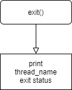

### Data Structure

별도의 data structure가 필요하지 않다.

### Implementation

```c
static void
syscall_handler (struct intr_frame *f UNUSED) 
{
    ...

  switch (syscall_num)
  {
      ...

    case SYS_EXIT:
      validate_addr(esp+1);
      syscall_exit(*(esp+1));
      break;

      ...
  }
}

void
syscall_exit(int status)
{
  printf("%s: exit(%d)\n", thread_name(), status);
  ...
}
```

위와 같이 `exit()` syscall을 호출할 때, 요구한 포맷의 문자열을 출력한다.

## 2. Argument Passing

### Control Flow

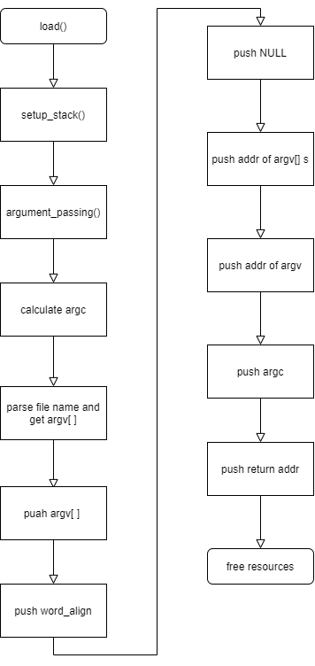

### Data Structure

별도의 data structure가 필요하지 않다.

### Implementation

```c
static bool
setup_stack (void **esp, char* file_name) 
{
    ...
=======
## 3. System call - User Process Manipulation
>>>>>>> 846d043b4a33daa70e373f62d2f26e95cd967542

  argument_passing(esp, file_name);

    ...

  return success;
}

static void
argument_passing(void** esp, char* file_name)
{
  char *token;
  char *save_ptr;
  char *copy_file;
  char **argv;
  int i;
  int argc = 0;
  int total_len = 0;

  copy_file = malloc(strlen(file_name)+1);
  strlcpy(copy_file, file_name, strlen(file_name)+1);

  /* get argc */
  for (token = strtok_r (copy_file, " ", &save_ptr); token != NULL;
    token = strtok_r (NULL, " ", &save_ptr))
    argc++;
  
  argv = (char **)malloc(sizeof(char*) * argc);

  /* get argv[] */
  for (i = 0, token = strtok_r (file_name, " ", &save_ptr); i < argc; 
    i++, token = strtok_r(NULL, " ", &save_ptr))
    {
      argv[i] = token;
    }
  
  /* push argv[] */
  for(i = argc-1; i>=0; i--)
  {
    int len = strlen(argv[i]) + 1;
    *esp -= len;
    total_len += len;
    memcpy(*esp, argv[i], len);
    argv[i] = *esp;
  }

  /* push word-align */
  int word_align_len = total_len % 4 != 0 ? 4 - (total_len % 4) : 0;
  *esp -= word_align_len;
  memset(*esp, 0, word_align_len);

  /* push NULL */
  *esp -= sizeof(char*);
  memset(*esp, 0, sizeof(char*));

  /* push argv[] addr */
  for(i = argc-1; i>=0; i--)
  {
    *esp -= sizeof(char*);
    memcpy(*esp, &argv[i], sizeof(char*));
  }
  
  /* push address of argv */
  int addr_argv = *esp;
  *esp -= sizeof(char**);
  memcpy(*esp, &addr_argv, sizeof(char**));

  /* push argc */
  *esp -= sizeof(int);
  memcpy(*esp, &argc, sizeof(int));

  /* push return addr */
  *esp -= sizeof(void *);
  memset(*esp, 0, sizeof(void *));

  free(copy_file);
  free(argv);
}
```

위와 같이, 새로운 process가 스택을 만들고 나서 argument passing을 수행해준다.

Argument passing은 아래의 순서를 거친다.

1. **`argc`와 `argv` 구하기**
   - argc를 먼저 구하고, 이를 바탕으로 argv를 구한다.
2. **`argv[]` 값 push**
   - 뒤에서부터 push한다. (... 4, 3, 2, 1 ... 순서대로)
   - push 한 후에는 `argv[]`에 해당 값이 들어간 스택의 주소를 저장한다.
3. **`word-align` push**
   - `total_len`이 4의 배수가 되도록 0을 push한다.
4. **`NULL` push**
   - NULL을 넣는다.
5. **`argv[]` 주소값 push**
   - `argv[]`를 뒤에서부터 push한다.
6. **`argv` 주소값 push**
   - 가장 마지막으로 넣은 `argv[]`를 다시 push
7. **`argc` 값 push**
   - `argc`를 push
8. **`return address` push**
   - NULL을 넣는다.
9. **`free` resources**
   - `argv` free
   - `copy_file` free

## 3. System call - User Process Manipulation

### Data Structure

```c
struct thread
{
    ...

    /*for project 2 */
    struct thread* parent;
    struct list childs;
    struct list_elem child_elem;

    struct semaphore child_lock;
    struct semaphore wait_lock;
    struct semaphore exit_reaping_lock;

    int exit_status;
    bool is_load_failed_thread;
}
```

### Overall

#### Implementation

```
static void
syscall_handler (struct intr_frame *f UNUSED) 
{
  int *esp = f->esp;

  validate_addr(esp);
  int syscall_num = *esp;
  switch (syscall_num)
  {
    case SYS_HALT:
      syscall_halt();
      break;
    case SYS_EXIT:
      ...
      break;
    ...
  }
}

void
validate_addr(const void* vaddr)
{
  int i;
  for(i=0; i<4; i++)
  { 
    if(validate_byte(vaddr+i) == false)
      syscall_exit(-1);
  }
}

bool 
validate_byte(const void* byte)
{
  if(is_kernel_vaddr(byte))
    return false;
  if(!pagedir_get_page(thread_current()->pagedir, byte)) //page fault
    return false;

  return true;
}
```

Syscall은 스택에 인자를 넣어서 호출되게 된다.

맨 아래에는 syscall number가 들어있고, 그 위로 순서대로 첫 번째 인자, 두 번째 인자, 세 번째 인자가 들어있다.

이때, 이 인자가 올바른 접근인지 판단하기 위해 `validate_addr()`를 사용한다.

`validate_addr()`은 주어진 주소를 바이트 단위로 검사한다.

만약 어떤 바이트가 커널의 주소를 가르키거나, 페이지 폴트를 일으키는 경우 비정상 종료(exit -1)를 한다.

검증이 끝난 후, syscall number를 가지고 switch case를 통해 적절한 handling을 해준다.

### halt

#### Control Flow

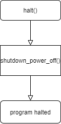

#### Implementation

```c
static void
syscall_handler (struct intr_frame *f UNUSED) 
{
  switch (syscall_num)
  {
    case SYS_HALT:
      syscall_halt();
      break;
    
    ...
  }
}

void
syscall_halt()
{
  shutdown_power_off();
  NOT_REACHED();
}
```

Halting은 단순하다.

제공된 함수 `shutdown_power_off()`를 통해 종료시키면 된다.

### exit

#### Control Flow

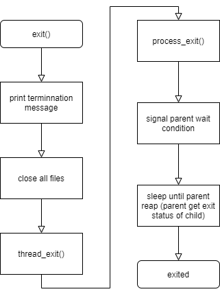

#### Implementation

```c
static void
syscall_handler (struct intr_frame *f UNUSED) 
{
  switch (syscall_num)
  {
    case SYS_EXIT:
      validate_addr(esp+1);
      syscall_exit(*(esp+1));
      break;
    
    ...
  }
}

void
syscall_exit(int status)
{
  printf("%s: exit(%d)\n", thread_name(), status);
  thread_current()->exit_status = status;
  close_files();
  thread_exit();
  NOT_REACHED();
}

void
close_files()
{
  int i;
  for(i = 0; i<130; i++)
    syscall_close(i);
}

void
process_exit (void)
{
  struct thread *cur = thread_current ();
  uint32_t *pd;
  /* Destroy the current process's page directory and switch back
     to the kernel-only page directory. */
  pd = cur->pagedir;
  if (pd != NULL) 
    {
      cur->pagedir = NULL;
      pagedir_activate (NULL);
      pagedir_destroy (pd);
    }
  
  sema_up(&cur->wait_lock);
  sema_down(&cur->exit_reaping_lock);
}
```

`exit()`는 1개의 인자를 사용하는 함수이다.

따라서 `esp+1`을 validate하고 `syscall_exit()`를 호출해준다.

`syscall_exit()`에서는 메모리 누수를 방지하기 위해 열려있는 모든 파일을 닫고, `thread_exit()`를 호출하여 프로세스를 종료한다.

`thread_exit()`에서 호출하는 `process_exit()`는 exit synchronization을 담당한다.

우선 parent의 wait lock을 풀어준다.

그리고 parent가 exit status를 회수할 때까지 (reaping) 할당 해제되지 않아야 하므로 대기한다.

이후 parent가 reaping lock을 풀어주면 `thread_exit()`로 돌아가 할당 해제된다.

### exec

#### Control Flow

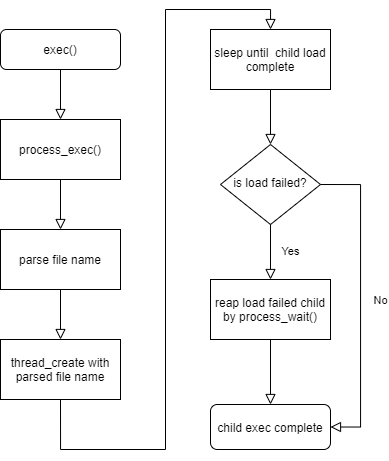

#### Implementation

```c
static void
syscall_handler (struct intr_frame *f UNUSED) 
{
  switch (syscall_num)
  {
    case SYS_EXEC:
      validate_addr(esp+1);
      validate_addr(*(esp+1));
      f->eax = syscall_exec(*(esp+1));
    
    ...
  }
}

pid_t 
syscall_exec(const char* cmd_line)
{
  return process_execute(cmd_line);
}

tid_t
process_execute (const char *file_name) 
{
  char *fn_copy;
  char *parsed_file_name;
  tid_t tid;
  struct list_elem* e;
  struct thread* t;

  /* Make a copy of FILE_NAME.
     Otherwise there's a race between the caller and load(). */
  fn_copy = palloc_get_page (0);
  if (fn_copy == NULL)
    return TID_ERROR;
  strlcpy (fn_copy, file_name, PGSIZE);

  parsed_file_name = malloc(strlen(file_name)+1);
  parse_file_name(file_name, parsed_file_name);

  /* Create a new thread to execute FILE_NAME. */
  tid = thread_create (parsed_file_name, PRI_DEFAULT, start_process, fn_copy);
  free(parsed_file_name);

<<<<<<< HEAD
  if (tid == TID_ERROR)
    palloc_free_page (fn_copy); 

  /* Wait until load complete */
  sema_down(&thread_current()->child_lock);

  for (e = list_begin(&thread_current()->childs); e != list_end(&thread_current()->childs); e = list_next(e)) {
    t = list_entry(e, struct thread, child_elem);
      if (t->is_load_failed_thread) {
        return process_wait(tid);
      }
  }

  return tid;
}
```

`exec()`는 1개의 인자를 사용하는 함수이다.

다만 인자가 포인터 변수이므로 `esp+1`와 `*(esp+1)`을 validate하고 `syscall_exec()`를 호출해준다.

`process_execute()`는 아래의 과정으로 이루어진다.

우선 전달된 명령어를 파싱하여 파일 이름을 얻어낸다.

이 얻어낸 파일 이름을 가지고 `thread_create()`를 통해 파일을 로딩한다.

이때, 이 로딩이 끝날 때까지 기다렸다가, 로딩이 끝나면 로딩이 실패했는지 성공했는지 판단한다.

만약 실패했다면 실패한 child를 `process_wait()`를 통해 reaping 해준다.

만약 성공했다면 tid를 반환한다.

### wait

#### Control Flow

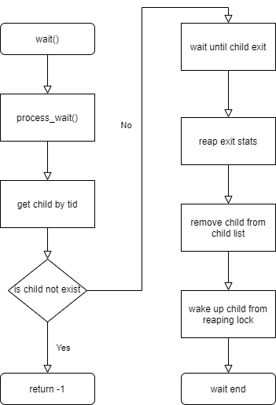

#### Implementation

```c
static void
syscall_handler (struct intr_frame *f UNUSED) 
{
  switch (syscall_num)
  {
    case SYS_WAIT:
      validate_addr(esp+1);
      f->eax = syscall_wait(*(esp+1));
      break;
    ...
  }
}

int 
syscall_wait(pid_t pid)
{
  return process_wait(pid);
}

int
process_wait (tid_t child_tid UNUSED) 
{
  struct thread* child = find_child_by_tid(child_tid);

  if(child == NULL)
    return -1;

  sema_down(&child->wait_lock);
  int exit_status = child->exit_status;
  remove_child_by_tid(child_tid);
  sema_up(&child->exit_reaping_lock);
  return exit_status;
}
```

`wait()`는 1개의 인자를 사용하는 함수이다.

따라서 `esp+1`을 validate하고 `syscall_wait()`을 호출해준다.

`process_wait()`은 child가 종료되길 기다렸다가 child의 exit status를 회수하는 함수이다.

우선 기다리고자 하는 child를 얻어낸다.

만약 그런 child가 존재하지 않는다면 -1을 리턴한다.

만약 존재한다면, 해당 child가 `exit()`를 호출할 때까지 기다린다.

Child가 `exit()`를 호출하여 `wait_lock`이 풀리면, child의 exit status를 회수한다.

이때 child는 parent가 exit status를 회수하길 기다리고 있을 것이므로, child의 `exit_reaping_lock`을 풀어준다.

그리고 회수한 `exit_status`를 반환한다.

## 4. System call - File Manipulation

### Data Structure

`struct thread`:

```c
struct thread
  {
    /* ... */
    
    struct file* fd_table[130];
		
  	/* ... */
  };
```

`struct thread` 에는 file descriptor table이 없었기 때문에 배열의 형태로 file pointer의 배열인 `fd_table[]`을 선언해줬다.

배열의 크기가 130인 이유는 기본 입출력을 위한 file descriptor 0, 1을 제외하고 최대 128개의 새로운 파일이 더 다뤄질 수 있기 때문이다.

`syscall.h`:

```c
struct lock filesys_lock;
```

file system에 대한 동시 접근을 제한하기 위해 `filesys_lock`이라는 lock을 추가해 global로 선언했다.


### Overall

#### Implementation

`init_thread()`:

```c
static void
init_thread (struct thread *t, const char *name, int priority)
{
	/* ... */

  /* file descriptor */ 
  for (int i = 0; i < 130; i++) {                                                         
      t->fd_table[i] = NULL;                                                                
  }   

  /* ... */
}
```

`init_thread()` 동작을 할 때 새로운 thread의 file descriptor을 NULL pointer로 초기화해준다.

`pintos/src/userprog/syscall.h`:

```c
struct lock filesys_lock;
```

우리의 구현에서는 file open, read, write를 할 때 file system 전체에 대한 동시 접근을 허용하지 않기 위해 filesys_lock을 사용한다.


### create

#### Control Flow

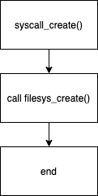

#### Implementation

`syscall_create()`:

```c
bool syscall_create(const char* file, unsigned initial_size)
{
  return filesys_create(file, (off_t) initial_size);
}

/* Creates a file named NAME with the given INITIAL_SIZE.
   Returns true if successful, false otherwise.
   Fails if a file named NAME already exists,
   or if internal memory allocation fails. */
bool
filesys_create (const char *name, off_t initial_size) 
{
  /* ... */
}
```

`syscall_create()` 는 `filesys_create()`를 호출해 `const char* file` 라는 이름과 `initial_size` 크기를 갖는 file을 생성한다.


### remove

#### Control Flow

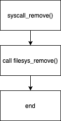

#### Implementation

`syscall_remove()`:

```c
bool syscall_remove(const char* file)
{
  return filesys_remove(file);
}

/* Deletes the file named NAME.
   Returns true if successful, false on failure.
   Fails if no file named NAME exists,
   or if an internal memory allocation fails. */
bool
filesys_remove (const char *name) 
{
  struct dir *dir = dir_open_root ();
  bool success = dir != NULL && dir_remove (dir, name);
  dir_close (dir); 

  return success;
}
```

`syscall_remove()`는 간단하게 `filesys_remove()` 를 호출해 file name을 넘겨준다. file name을 넘겨 받은 `filesys_remove()`는 디렉토리에서 file name과 같은 파일 이름을 갖는 파일을 삭제하고 그 결과를 return한다.


### open

#### Control Flow

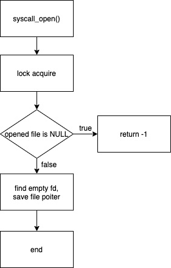

#### Implementation

`syscall_open()`:

```c
int syscall_open(const char* file)
{
  lock_acquire(&filesys_lock);
  struct file* opened_file = filesys_open(file);
  int i;
  
  if(opened_file == NULL)
  {
    lock_release(&filesys_lock);
    return -1;
  }

  for(i = 2; i<130; i++)
  {
    if(thread_current()->fd_table[i] == NULL)
    {
      if(strcmp(thread_name(), file) == 0)
        file_deny_write(opened_file);

      thread_current()->fd_table[i] = opened_file;
      lock_release(&filesys_lock);
      return i;
    }
  }
  lock_release(&filesys_lock);
  return -1;
}
```

file open을 진행할 때 다른 system call의 동시 접근을 막기 위해 시작할 때 `filesys_lock`에 대해 lock acquire을 진행한다.

이후 file name을 가지는 파일을 열고, NULL pointer인 file descriptor, 즉 아무 file도 가리키고 있지 않은 file decriptor을 찾는다 (2부터 검색하는 이유는 0, 1은 표준 입출력이기 때문이다).

만약 빈 자리를 찾게 되면 현재 thread name과 file name을 비교한다. thread name이 의미하는 것은 현재 thread에 의해 실행되고 있는 파일이기 때문에 이 경우 뒤에서 다룰 `file_deny_write()`을 이용해 `opened_file`에 대한 쓰기 권한을 통제해야 한다.

그리고 빈 table에 file pointer을 저장해준다.

모든 과정을 거치고 난 뒤에 file system에 대한 lock을 풀어준다.


### filesize

#### Control Flow

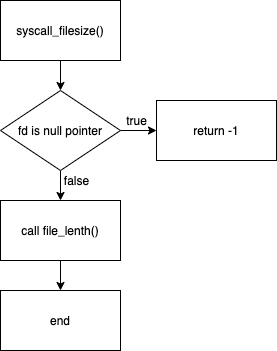

#### Implementation

`syscall_filesize()`:

```c
int syscall_filesize(int fd)
{
  if(thread_current()->fd_table[fd] == NULL)
    return -1;

  return (int) file_length(thread_current()->fd_table[fd]);
}
```

`fd`를 받아 해당하는 file이 존재하는지 우선 살핀다. 만약 존재하지 않는다면 -1을 반환한다.

그리고 존재한다면 `file_lenth()`를 호출해 file size를 반환한다.


### read

#### Control Flow

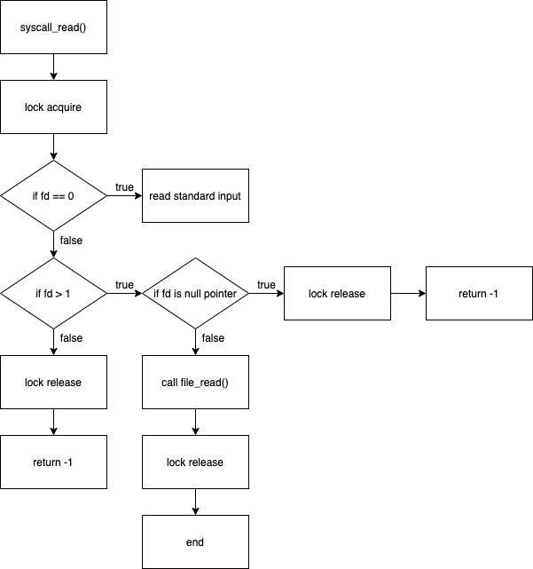

#### Implementation

`syscall_read()`:

```c
int 
syscall_read(int fd, const void* buffer, unsigned size)
{
  lock_acquire(&filesys_lock);
  int result;
	uint8_t* bf = (uint8_t *) buffer;
  if(fd == 0)
  {
    int i = 0;
    uint8_t b;
    for(i=0; i<size; i++)
    {
      if(b = input_getc() == NULL)
        break;
      else
        *bf++ = b;
    }
    result = i;
  }
  else if(fd > 1)
  {
    if(thread_current()->fd_table[fd] == NULL)
      result = -1;
    else
      result = (int) file_read(thread_current()->fd_table[fd], buffer, (off_t) size);
  }
  else
    result = -1;
  
  lock_release(&filesys_lock);
  return result;
}
```

file을 open할 때와 마찬가지로 read를 진행할 때에도 `filesys_lock`에 대한 점유가 이루어져야 한다. 

만약 fd==0이라면 표준 입력이므로 키보드로 이루어지는 입력을 `input_getc()` 함수를 이용해 buffer에 저장한다.

만약 fd>1이라면 파일의 데이터를 읽게 되는 것이므로 `file_read()` 를 이용해 파일의 데이터를 buffer에 저장한다.

모든 과정이 끝나고 난 뒤에는 lock에 대한 점유를 풀어준다.


### write

#### Control Flow

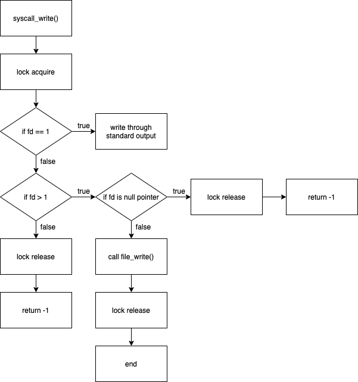

#### Implementation

`syscall_write()`

```c
int 
syscall_write(int fd, const void* buffer, unsigned size)
{
  int result;
  lock_acquire(&filesys_lock);
  
  if(fd == 1)
  {
    putbuf(buffer, size);
    result = size;
  }
  else if(fd > 1)
  {
    if(thread_current()->fd_table[fd] == NULL)
      result = -1;
    else
      result = (int) file_write(thread_current()->fd_table[fd], buffer, (off_t) size);
  }
  else
    result = -1;

  lock_release(&filesys_lock);
  return result;
}
```

`syscall_read()`와 마찬가지로 우선 file system에 대한 lock을 점유한다.

만약 fd==1이면 표준 출력을 의미하므로 buffer에 있는 데이터를 화면에 출력한다.

만약 fd>1이라면 file에 데이터를 write하게 되는 것이므로 `file_write()` 를 이용해 buffer의 데이터를 file에 기록한다.

모든 과정이 끝나고 난 후엔 file system에 대한 lock 점유를 풀어준다.


### seek

#### Control Flow

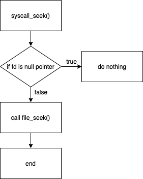

#### Implementation

`syscall_seek()`:

```c
void syscall_seek(int fd, unsigned position)
{
  if(thread_current()->fd_table[fd] == NULL)
    return;
  else
    file_seek(thread_current()->fd_table[fd], (off_t) position);
}
```

`syscall_seek()`는 opened file을 찾아 그 위치를 `position`만큼 이동시켜준다.

만약 fd에 해당하는 table entry에 NULL pointer가 저장되어 있다면 아무 동작도 하지 않고 return한다.

그렇지 않다면 `file_seek()`함수를 이용해 `position`만큼 파일 위치를 이동시킨다.


### tell

#### Control Flow

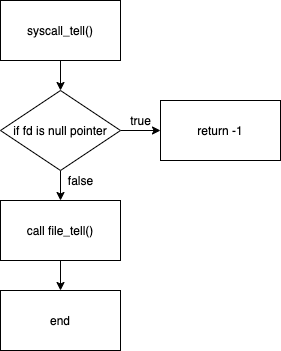

#### Implementation

`syscall_tell()`:

```c
unsigned syscall_tell(int fd)
{
  if(thread_current()->fd_table[fd] == NULL)
    return -1;
  else
    return (unsigned) file_tell(thread_current()->fd_table[fd]);
}
```

`syscall_tell()`은 단순히 file의 위치를 반환한다. 만약 fd에 해당하는 table entry가 NULL pointer라면 -1을 반환하고, 그렇지 않다면 `file_tell()`을 호출해 file pointer에 해당하는 파일의 위치를 반환한다.


### close

#### Control Flow

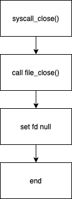

#### Implementation

`syscall_close()`:

```c
void syscall_close(int fd)
{
  file_close(thread_current()->fd_table[fd]);
  thread_current()->fd_table[fd] = NULL;
}
```

`syscall_close()`는 fd가 가리키고 있는 file을 닫고 그 entry를 NULL pointer로 설정한다.

우리 구현에서는 배열의 형식을 채택했으므로 별도의 메모리 해제는 필요로 하지 않는다.


## 5. Denying Writes to Executables

### Control Flow

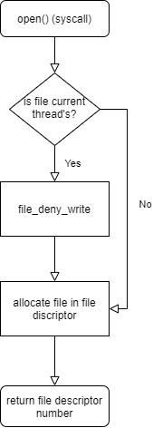

### Data Structure

별도의 data structure가 필요하지 않다.

### Implementation

```c
int syscall_open(const char* file)
{
  lock_acquire(&filesys_lock);
  struct file* opened_file = filesys_open(file);
  int i;
  
  if(opened_file == NULL)
  {
    lock_release(&filesys_lock);
    return -1;
  }

  for(i = 2; i<130; i++)
  {
    if(thread_current()->fd_table[i] == NULL)
    {
      /* If this file is thread_curernt's file */
      if(strcmp(thread_name(), file) == 0)
        file_deny_write(opened_file);

      thread_current()->fd_table[i] = opened_file;
      lock_release(&filesys_lock);
      return i;
    }
  }
  lock_release(&filesys_lock);
  return -1;
}
```

원래의 구현은 `load()`를 할 때 `file_deny_write()`를 호출하는 방식이었다.

그러나 이 경우, `load()`가 끝나면서 `file_close()`를 하기 때문에 의미가 없어진다.

따라서 `open()`를 할 때  `file_deny_write()`를 호출하는 방식으로 바꿨다.

이때 executable file 인지 확인하기 위해 `strcmp()`를 사용하였다.

# Screenshot

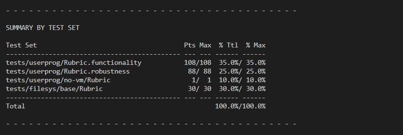

# Discussion

## Differences from design

### 1. Process Termination Messages

디자인 상에서는 `exit_code` field를 두고 `process_exit()`에서 메세지를 출력하고자 했다.

그러나 실제 구현에서는 응집성을 위해 `process_exit()`가 아닌 `syscall_exit()`에서 출력하게 바뀌었다.

### 2. Argument Passing

함수 이름이 변경된 것을 제외하고 차이점은 없다.

### 3. System call

전체적인 구현의 방향은 같으나, 세부사항은 모두 달라졌다.

**User Process Manipulation** 파트의 경우 여러 synchronization 기법의 세부사항이 달라졌다.

기존 구현에서는 여러가지 변수(tid, is_success, is_child_wait)들을 통해 복잡하게 synchronization을 구현했었다.

그러나 이런 구현법으로는 multi-oom을 통과할 수 없었다.

그래서 관점을 바꾸어서 semaphore의 소유를 child에게 넘겨서 여러가지 복잡한 condition 판단을 제거했다.

**File Manipulation** 파트의 경우 구체적인 예외 상황 처리가 디자인과 달라졌다.

기존 구현에서는 `syscall_open()`을 진행할 때 thread name과 file name을 비교하는 과정이 없었으나 실제 구현에서는 deny writing이 필요하게 됨에 따라 이 과정이 포함되었다.

이외에도 file open시 file pointer가 null pointer가 아닌지 검사하는 과정 등이 실제 구현에서 추가되었다.

### 4. Denying Writes to Executables

디자인 상에서는 `running_file` field를 두고, `load()`에서 `file_deny_write()`를 호출하여 write를 막고, 이후에 `file_allow_write()`를 호출하여 잠금을 푸는 방식으로 구현하고자 하였다.

그러나 실제 구현을 하면서 세 가지 사실을 깨닫게 되었다.

1. `running_file`을 안쓴다
2. `file_close()`를 하면 알아서 `file_allow_write()`가 호출된다
3. `load()`에서 `file_deny_write()`를 호출해봤자 `file_close()`에 의해 무효화 된다.

그래서 최종 구현은 아래와 같이 바뀌었다.

1. `running_file` field를 지운다.
2. `load()`가 아닌 `open()`에서 `file_deny_write()`를 호출한다.
3. 별도로 `file_allow_write()`를 호출하지 않는다.

## Review

- 하재현

Project 1보다는 쉬웠지만, multi-oom test가 정말 어려웠었다.

그러나 그만큼 포인터, 메모리 구조, 운영체제 등의 개념을 제대로 익힐 수 있었던 귀중한 시간이었다.

- 최진수

system call은 언뜻 보면 간단해 보이고, 단순히 커널의 어떤 똑같은 기능을 하는 함수를 호출하는 것이 다일 때도 있지만, 이것이 응용 프로그램의 요청으로 커널에 안전하게 접근하기 위한 방법임을 배울 수 있는 시간이었다.