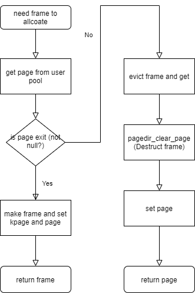
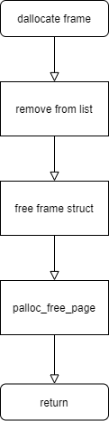
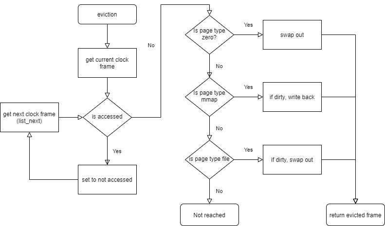
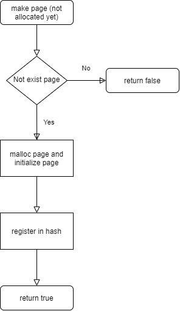
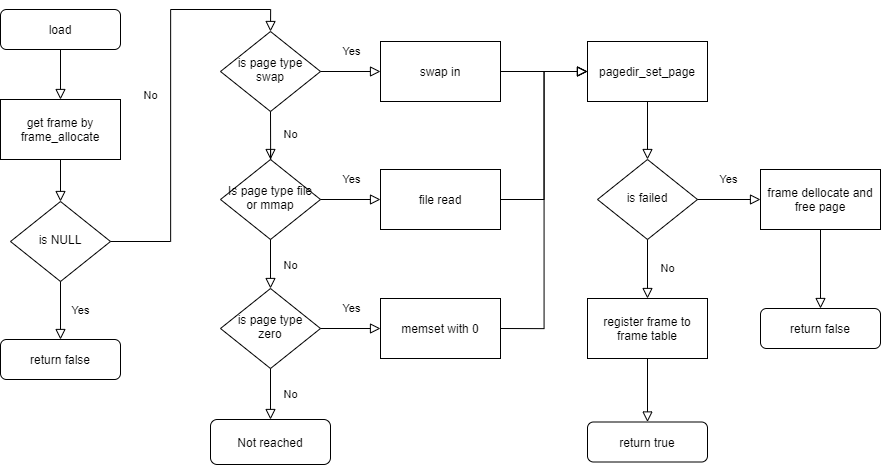
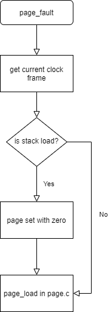
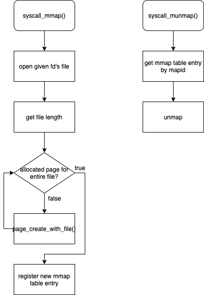
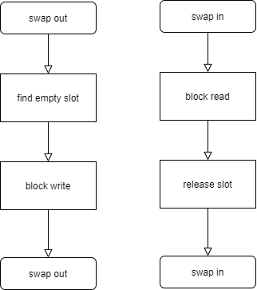
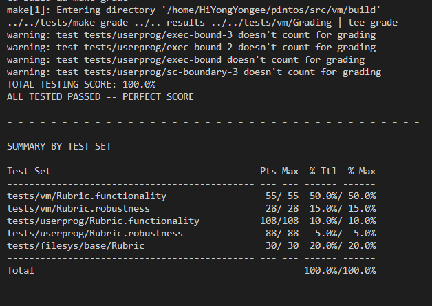

# [CSED312] OS project 3 Final Report

- 20180673 하재현
- 20180501 최진수

# Requirements

설명을 좀 더 편하게 하기 위해 guideline의 Requirements 순서를 약간 바꾸었다.

바뀐 부분은 [2번 s-page table](#2-supplemental-page-table)과 [3번 Lazy Loading](#3-lazy-loading)이다.

## 1. Frame Table

### Control Flow

- **Allocate**

  

- **Deallocate**
  
  

- **Clock algorithm eviction**
  
  

### Data Structure

```c++
struct frame
    {
        void *kpage;            //Address
        struct page* page;      //S page table entry
        struct list_elem elem;  //For table
    };

static struct list frames;

static struct lock frames_lock;

static struct list_elem* frame_clock_points;
```

### Implementation

- Initialize
  
  ```c++
  void
  frame_init (void)
  {
      lock_init(&frames_lock);
      list_init(&frames);
      frame_clock_points = list_tail(&frames);
  }
  ```

  우선 frame table을 초기화 해야한다.

  본 구현에서는 frame table을 list로 구현했으르모, `list_init`를 해준다.

  또한, clock algorithm에서 현재 pointing 하고 있는 frame을 가리키는 frame_clock_points은 `list_tail`로 초기화 해준다.

- Allocate/deallocate frames
  
  ```c++
  struct frame*
  frame_allocate(struct page* page)
  {
      lock_acquire(&frames_lock);

      struct frame* new_frame = NULL;
      void* kpage = palloc_get_page(PAL_USER);
      if(kpage == NULL) //No free page, eviction needs
          new_frame = frame_evict_and_reassign(page);
      else
      {
          new_frame = malloc(sizeof(struct frame));

          if(new_frame == NULL) 
          {
              palloc_free_page(kpage);
          }
          else
          {
              new_frame->kpage = kpage;
              new_frame->page = page;
          }
      }

      lock_release(&frames_lock);
      return new_frame;
  }
  ```

  Frame allocation은 `frame_allocate` 함수를 통해 이뤄진다.

  `frame_allocate` 함수는 해당 frame과 mapping 하고자 하는 page를 전달받는다.

  우선 `palloc_get_page(PAL_USER)`를 통해 user pool에서 page를 할당받는다.

  만약 NULL이라면 pool이 비었다는 의미이므로 eviction을 해준다.

  Eviction을 한 frame에 대해 page를 등록하고 이를 반환한다.

  반대로 NULL이 아니라면, 주소와 page를 등록해준 후 이를 반환한다.

  전 후로 lock을 거는 것은 frame table을 동시 접근하는 것을 막기 위해서이다.

  ```c++
    void
    frame_remove(struct frame* frame_to_remove, bool is_free_page)
    {
        lock_acquire(&frames_lock);
        ASSERT(frame_to_remove != NULL);

        if(frame_clock_points == &frame_to_remove->elem) 
            frame_clock_points = list_next(frame_clock_points);

        if(is_free_page) 
            palloc_free_page(frame_to_remove->kpage);
        
        list_remove(&frame_to_remove->elem);
        free(frame_to_remove);

        lock_release(&frames_lock);
    }
  ```

  Deallocation은 위 함수에 의해 이뤄진다.

  굳이 flag를 통해 free page 여부로 두개를 구분해야 하는 이유는 7번을 구현하기 위해서이다.

  `palloc_free_page`가 사용되는 경우는 page 할당이 실패하여 frame도 할당을 해제해야 하는 상황이다.

  `palloc_free_page`가 사용되지 않는 상황은 process가 종료할 때이다. Process가 종료하면 종료 함수에서 page를 할당 해제하므로, `palloc_free_page`를 하면 에러가 나기 때문이다.

- Choose a victim which returns frames when free doesn't exist
  
  ```c++
  struct frame*
  frame_evict_and_reassign(struct page* page)
  {
      ASSERT (lock_held_by_current_thread (&frames_lock));
      struct frame* frame = frame_to_evict();
      if(frame == NULL) return NULL;
      
      if(!frame_evict(frame)) return NULL;
      frame_page_reassign_and_remove_list(frame, page);
      return frame;
  }
  ```

  Eviction은 위에서 설명했듯 `palloc_get_page`이 NULL을 반환하면 이뤄진다.

  Eviction을 담당하는 함수는 `frame_evict_and_reassign`이다.

  이 함수는 clock algorithm으로 골라진 frame을 evict하고, 해당 frame을 다시 반환한다.

  ```c++
  struct frame*
  frame_to_evict(void) 
  {
      ASSERT (lock_held_by_current_thread (&frames_lock));

      struct frame* frame = frame_clock_forward();
      while(pagedir_is_accessed (get_pagedir_of_frame(frame), frame->page->upage))
      {
          pagedir_set_accessed (get_pagedir_of_frame(frame), frame->page->upage, false);
          frame = frame_clock_forward();
      }

      return frame;
  }

  struct frame*
  frame_clock_forward(void)
  {
      ASSERT (lock_held_by_current_thread (&frames_lock));

      struct list_elem* next_elem;
      if(is_tail(frame_clock_points) || is_back(frame_clock_points)) next_elem = list_front(&frames);
      else next_elem = list_next(frame_clock_points);

      frame_clock_points = next_elem;
      return list_entry (next_elem, struct frame, elem);
  }
  ```

  `frame_to_evict`은 clock algorithm으로 free할 frame을 반환하는 함수이다.
  
  전체 frame table을 순회하며 not accessed 인 frame을 찾는다.

  만약 accessed 라면, not accessed로 바꾼다. (Second chance)

  이때 다음으로 넘어가는 기능을 담당하는 것이 `frame_clock_forward`이다.

  함수가 복잡해 보이지만, 이는 핀토스에서의 list 구현 방식 때문이다.

  `is_tail`이 있는 이유는 초기화를 tail로 했기 때문이다.

  `is_back`이 있는 이유는 back에서 next를 하면 tail로 가버리기 때문이다.

  ```c++
    static inline bool
    is_dirty(struct frame* frame)
    {
        return pagedir_is_dirty(get_pagedir_of_frame(frame), frame->page->upage)
        || pagedir_is_dirty(get_pagedir_of_frame(frame), frame->kpage);
    }

    bool
    frame_evict(struct frame* frame)
    {
        ASSERT (lock_held_by_current_thread (&frames_lock));

        struct page* page = frame->page;
        bool dirty = is_dirty(frame);

        page->prev_type = page->type;
        switch (page->type)
        {
        case PAGE_ZERO:
            if(!swap_frame(page, frame)) return false;
            break;
        
        case PAGE_MMAP:
            if(dirty)
                mmap_file_write_at(page->file, frame->kpage, page->read_bytes, page->ofs);
            break;
        
        case PAGE_FILE:
            if(page->writable && dirty)
                if(!swap_frame(page, frame)) return false;
            break;

        default:
            NOT_REACHED();
            break;
        }

        page->frame = NULL;
        pagedir_clear_page(get_pagedir_of_frame(frame), page->upage);
        return true;
    }
  ```

  Evict할 frame을 선정했다면, eviction을 진행한다.

  Page의 type에 따라 적절한 eviction을 해야한다.

  `PAGE_ZERO`, 즉 스택 영역이라면 그냥 swap out한다.

  `PAGE_MMAP`, 즉 mmap이라면 write back한다.

  `PAGE_FILE`, 즉 스택 외에 프로그램 파일 영역이라면 dirty 인 경우에만 swap out한다.

  Eviction을 한 뒤, 해당 frame과 연결되어 있는 page를 page dir에서 지우고, 연결을 끊는다.

- Search frames used by user process
  
  ```c++
  struct page 
      {
          ...
          struct frame* frame;
          ...
      };
  ```

  Process는 page hash table을 갖고 있고, 각 page는 frame을 가지고 있다.

  이를 통해 해당 process가 갖고 있는 frame에 접근할 수 있다.
  
- Frames used by user pages must be allocated by “user pool”.
  
  ```c++
  struct frame*
  frame_allocate(struct page* page)
  {
      lock_acquire(&frames_lock);
      ...
      void* kpage = palloc_get_page(PAL_USER);
      ...
  }
  ```

  `palloc_get_page(PAL_USER)`를 통해 user pool에만 접근한다.

- Modify process loading (the loop in “load_segment()”) in “userprog/process.c” for managing a frame table

  [Lazy Loading](#3-lazy-loading) 에서 설명하겠다.

## 2. Supplemental Page Table

### Control Flow

- **Make page**
  
  

- **Load frame into page**
  
  

### Data Structure

```c++
enum page_type
  {
    PAGE_ZERO,          
    PAGE_FILE,
    PAGE_MMAP,
    PAGE_SWAP
  };

struct page 
    {
        struct thread* thread;
        struct hash_elem elem; 

        struct frame* frame;
        void* upage;
        
        size_t swap_index;
        
        struct file* file;
        bool writable;
        uint32_t read_bytes;
        uint32_t zero_bytes;
        off_t ofs;

        enum page_type type;
        enum page_type prev_type;
    };

struct thread
{
   struct hash *pages;  /* Project 3 virtual pages */
};
```

### Implementation

```c++
bool
page_create_with_file(
    void* upage, struct file* file, off_t ofs, uint32_t read_bytes, 
    uint32_t zero_bytes, bool writable, bool is_mmap)
{
    if(page_find_by_upage(upage) != NULL)
        return false;

    struct page* new_page = malloc(sizeof(struct page));
    if(new_page != NULL)
    {
        new_page->upage = upage;
        new_page->file = file;
        new_page->ofs = ofs;
        new_page->read_bytes = read_bytes;
        new_page->zero_bytes = zero_bytes;
        new_page->writable = writable;
        new_page->swap_index = BITMAP_ERROR;
        new_page->thread = thread_current();
        new_page->frame = NULL;
        new_page->type = is_mmap ? PAGE_MMAP : PAGE_FILE;

        hash_insert(thread_current()->pages, &new_page->elem);
        return true;
    }
    else
    {
        return false;
    }
}

bool
page_create_with_zero(void *upage)
{
    if(page_find_by_upage(upage) != NULL)
        return false;

    struct page* new_page = malloc(sizeof(struct page));    
    if(new_page != NULL)
    {
        new_page->upage = upage;
        new_page->file = NULL;
        new_page->ofs = 0;
        new_page->read_bytes = 0;
        new_page->zero_bytes = 0;
        new_page->writable = true;
        new_page->swap_index = BITMAP_ERROR;
        new_page->thread = thread_current();
        new_page->frame = NULL;
        new_page->type = PAGE_ZERO;

        hash_insert(thread_current()->pages, &new_page->elem);
        return true;
    }
    else
    {
        return false;
    }
}
```

Page는 우선 두 함수에 의해 frame이 없는 상태로 만들어진다.

`page_create_with_file`는 file에서 데이터를 읽어야 하는 page를 만들 때 사용한다.

`page_create_with_zero`는 stack 영역의 page를 만들 때 사용한다.

두 함수의 차이는 크게 없으나, `page_type`이 다르다.

`page_create_with_file`는 `is_mmap ? PAGE_MMAP : PAGE_FILE`로 page type을 정한다.

`page_create_with_zero`는 `PAGE_ZERO`로 고정이다.

이후, 이 빈 page에 frame을 넣어주는 함수가 `page_load`이다.

```c++
bool
page_load(void *upage)
{
    struct page* page_to_load = page_find_by_upage(upage);
    if (page_to_load == NULL || page_to_load->frame != NULL)
        return false;
    
    struct frame* new_frame = frame_allocate(page_to_load);
    if(new_frame == NULL)
        return false;
    
    bool success;
    switch (page_to_load->type)
    {
    case PAGE_SWAP:
        page_to_load->type = page_to_load->prev_type;
        success = swap_in(new_frame->kpage, page_to_load->swap_index);
        break;
    
    case PAGE_FILE:
    case PAGE_MMAP:
        success = page_load_with_file(new_frame, page_to_load);
        break;
    
    case PAGE_ZERO:
        success = memset(new_frame->kpage, 0, PGSIZE) != NULL;
        break;

    default:
        NOT_REACHED();
        break;
    }
    
    if(!success || !pagedir_set_page(thread_current ()->pagedir, upage, new_frame->kpage, page_to_load->writable))
    {
        frame_remove(new_frame, true);
        return false;
    }

    page_to_load->frame = new_frame;
    frame_push_back(page_to_load->frame); //After init, push
    return true;
}

bool
page_load_with_file(struct frame* f,struct page* p)
{
    if (file_read_at(p->file, f->kpage, p->read_bytes, p->ofs) != (int) p->read_bytes)
    {
        frame_remove(f, true);
        return false;
    }
    memset(f->kpage + p->read_bytes, 0, p->zero_bytes);
    return true;
}
```

`page_load`는 전달받은 upage에 할당된 page에 frame을 집어넣어주는 역할을 한다.

우선 `frame_allocate`를 통해 할당할 frame을 전달받는다.

이후 page type에 맞추어서 적절히 load를 수행해야 한다.

만약 `PAGE_SWAP`, 즉 이전에 swap out이 되었던 page라면 swap in을 수행해준다.

만약 `PAGE_FILE` 또는 `PAGE_MMAP`, 즉 file에서 읽어들어야 하는 경우라면 file read를 수행한다.

만약 `PAGE_ZERO`, 즉 스택 영역이라면 0으로 초기화해준다.

Frame에 값을 다 load했다면, page를 pagedir에 등록하고 page와 frame을 연결시켜준다.

이후 loading이 끝난 frame을 frame table에 등록시켜준다.

```c++
void
page_exit(void)
{
    struct hash* h = thread_current()->pages;
    if(h != NULL)
        hash_destroy(h, page_destory);
}

void
page_destory (struct hash_elem *e, void *aux UNUSED)
{
    struct page* p = hash_entry(e, struct page, elem);
    if(p->frame)
        frame_remove(p->frame->kpage);
    if(p->swap_index != BITMAP_ERROR) 
        swap_remove(p->swap_index);
    free(p);
}
```

한편 page table의 삭제는 `page_exit`를 통해 이뤄진다.

이는 `hash_destory`를 호출하여 hash table의 모든 entry에 대해 삭제 작업을 거쳐주는 함수이다.

삭제 작업은 연동된 frame을 잘 제거해주고, swap table도 비워준다.

## 3. Lazy Loading

### Control Flow



#### Implementation

```c++
static bool
load_segment(struct file *file, off_t ofs, uint8_t *upage,
             uint32_t read_bytes, uint32_t zero_bytes, bool writable)
{
    ASSERT((read_bytes + zero_bytes) % PGSIZE == 0);
    ASSERT(pg_ofs(upage) == 0);
    ASSERT(ofs % PGSIZE == 0);

    file_seek(file, ofs);
    while (read_bytes > 0 || zero_bytes > 0)
    {
        /* Calculate how to fill this page.
         We will read PAGE_READ_BYTES bytes from FILE
         and zero the final PAGE_ZERO_BYTES bytes. */
         
        size_t page_read_bytes = read_bytes < PGSIZE ? read_bytes : PGSIZE;
        size_t page_zero_bytes = PGSIZE - page_read_bytes;

        if(!page_create_with_file(upage, file, ofs, page_read_bytes, page_zero_bytes, writable, false))
            return false;

        /* Advance. */
        read_bytes -= page_read_bytes;
        zero_bytes -= page_zero_bytes;
        upage += PGSIZE;
        ofs += PGSIZE;
    }
    return true;
}
```

프로그램을 로드할 때, page를 install하는 것이 아닌, frame을 할당받지 못한 빈 page들을 만든다.

이 page로 접근을 하게 되면 page fault가 발생한다.

```c++
static void
page_fault(struct intr_frame *f)
{
    intr_enable();

    /* Count page faults. */
    page_fault_cnt++;

    /* Determine cause. */
    not_present = (f->error_code & PF_P) == 0;
    write = (f->error_code & PF_W) != 0;
    user = (f->error_code & PF_U) != 0;

    if(fault_addr == NULL || !not_present || !is_user_vaddr(fault_addr))
        syscall_exit(-1);

    if(is_stack_access(fault_addr, f->esp))
    {
        if(!page_create_with_zero(pg_round_down(fault_addr)))
            syscall_exit(-1);
    }

    if(page_load(pg_round_down(fault_addr)))
       return;
    else 
        syscall_exit(-1);    
}


static bool
is_stack_access(int32_t fault_addr, uint32_t* esp)
{
    return fault_addr >= (esp - 32) && 
            (PHYS_BASE - pg_round_down(fault_addr)) <= STACK_SIZE && 
            page_find_by_upage(pg_round_down(fault_addr)) == NULL;
}
```

Page fault가 발생하면, 유효한 주소인지 판단하여 lazy loading을 수행한다.

만약 해당 접근이 스택으로의 접근이면 스택 확장을 해주고, lazy loading을 한다.

아니라면, 그냥 lazy loading을 수행한다.

이때 `fault_addr`은 그냥 주소이므로, 가까운 페이지의 주소로 round down 해줘야 하므로 `pg_round_down`를 사용한다.

## 4. Stack Growth

### Control Flow

Lazy Loading과 동일하다.


#### Implementation

```c++
static bool
setup_stack(void **esp)
{
    if(!page_create_with_zero(PHYS_BASE - PGSIZE))
        return false;

    if(!page_load(PHYS_BASE - PGSIZE))
        return false;
        
    *esp = PHYS_BASE;
    return true;
}
```

처음 stack을 만들 때, 한 page만 만들어둔다.

이후, 해당 영역에 access를 하면 page fault가 발생한다.

할당된 stack 영역이 아닌 stack 영역에 접근하게 되면 `page_create_with_zero`를 거쳐 page without frame을 만들고, `page_load`를 거쳐 frame을 할당해준다.

## 5. File Memory Mapping

### Control Flow



### Data Structure

```c
1. syscall.h:

struct file_mapping{
  mapid_t mapid;
  struct file* file;
  struct list_elem elem;
  void* base;
  int page_count;
};


2. thread.h:

struct thread{
  /* ... */
  struct list file_mapping_list;
  /* ... */
};
```

File memory mapping part에서는 각 thread가 mamory mapping table을 만들어 file과 page 사이를 관리하게 된다.

따라서 table의 각 entry를 의미하는 data structure인 `struct file_mapping`에 mapid, file pointer, base address, page count(해당 파일이 페이지를 넘어가는 크기를 가질 수 있으므로)를 저장해 정보를 관리한다.


### Implementation

- `syscall_mmap()`

```c
static mapid_t
syscall_mmap (int fd, void *addr)
{
    struct file_descriptor_entry *fde = process_get_fde(fd);
    off_t len;
    struct file* file;
    if(addr == NULL || !is_user_vaddr(addr) || pg_ofs(addr) != 0)
    {
        return -1;
    }
    
    lock_acquire(&filesys_lock);
    file = file_reopen(fde->file);
    if(file == NULL)
    {
        lock_release(&filesys_lock);
        return -1;
    }
    else
    {
        len = file_length(file);
        lock_release(&filesys_lock);
    }
    
    off_t ofs=0;
    int page_count = 0;
    while(len > 0)
    {
        int read_bytes=len >= PGSIZE ? PGSIZE : len;
        int zero_bytes=len < PGSIZE ? (PGSIZE - len) : 0;
        if(!page_create_with_file(addr + ofs, file, ofs, read_bytes, zero_bytes, true, true))
        {
            clear_previous_pages(addr, ofs);
            file_close(file);
            return -1;
        }
        ofs+=read_bytes;
        len-=read_bytes;
        page_count++;
    }

    return register_new_mmap(file, addr, page_count);
}
```

`syscall_mmap()` 는 file descriptor와 base address가 인자로 주어졌을 때 file descriptor가 가리키고 있는 파일을 lazy loading을 통해 base address의 위치에 불러온다.

우선 address가 valid한지 확인하기 위해 null pointer가 아닌지, user 영역을 pointing하고 있는지, 그리고 page-aligned되어 있는지 확인하고, 이 사항을 만족하지 않으면 -1을 return한다.

그리고 파일을 open하고 pointer을 mmap table entry에 저장한 뒤, 해당 파일의 길이에 맞춰 lazy loading을 실시한다.

위의 코드에서 while문은 파일의 length가 여러 page를 넘어갈 수 있기 때문에 사용되고 있다. `page_create_with_file()`을 이용해 page 단위로 lazy loading을 순차적으로 실행한 뒤 mmap table entry에 그 사항을 기록한다.

만약 page allocating을 하다가(memory loading을 했다는 것과는 다른 의미이다) 중간에 문제가 생길 시에는 앞서 같은 파일에서 성공했던 page들도 clear시켜주는 과정이 필요하다.

- `syscall_munmap()`

```c
static void
syscall_munmap (mapid_t mapping)
{
    struct file_mapping *m = get_file_mapping_by_mapid(mapping);
    if(m == NULL) return;
    unmap(m);
}

void
unmap(struct file_mapping* m)
{
    lock_acquire (&filesys_lock);

    for(int i=0; i< m->page_count ; i++)
    {
        struct page* page = page_find_by_upage(m->base + PGSIZE * i);
        if(page == NULL) continue;
        if(page->frame)
        {
            if(pagedir_is_dirty (page->thread->pagedir, page->upage))
                file_write_at(page->file, page->frame->kpage, PGSIZE, PGSIZE * i);
            frame_remove(page->frame, true);
        }
        pagedir_clear_page (page->thread->pagedir, page->upage);
        hash_delete (page->thread->pages, &page->elem);
    }

    list_remove(&m->elem);
    file_close(m->file);
    free(m);
    lock_release (&filesys_lock);
    return;
}
```

첫째로, mapid를 인자로 받아 mapid에 해당하는 mmap table entry를 찾아낸다.

그리고 그로부터 해당 파일이 매핑되어 있는 page들을 unmap하는 과정을 거친다.

실제로 loading이 일어나 frame이 page에 배정된 상태라면 frame을 remove해준다. 만약 page directory가 dirty하다면 해당 page에 대해 write back을 실행한다.

매핑된 page들에 대해서는 공통적으로 page에 저장된 정보를 지우며, hash table에서 없애는 과정이 이루어져야 한다.

마지막으로 mmap table entry를 table에서 삭제한다.

- `frame_evict()`

```c
bool
frame_evict(struct frame* frame)
{
    /* ... */
    
    case PAGE_MMAP:
        if(dirty)
            mmap_file_write_at(page->file, frame->kpage, page->read_bytes, page->ofs);
        break;
    
    /* ... */
}
```

evict하려는 page가 dirty하다면 write back을 실행한다.


## 6. Swap Table

### Control Flow



### Data Structure

```c++
static struct block *swap_block_device;

static struct bitmap *swap_bitmap;

static struct lock swap_lock;

struct page 
    {
        size_t swap_index;
    };
```

### Implementation

```c++
void
swap_init(void)
{
    swap_block_device = block_get_role(BLOCK_SWAP);
    ASSERT(swap_block_device != NULL);
    swap_bitmap = bitmap_create(block_size(swap_block_device) / NUM_SECTORS_PER_PAGE);
    ASSERT(swap_bitmap != NULL);
    bitmap_set_all (swap_bitmap, true);
    lock_init(&swap_lock);
}
```

Swap init에서는 swap block을 등록하고, bitmap을 초기화한다.

Bitmap은 초기값으로 true, 즉 모두 할당 가능함을 의미한다.

```c++
size_t
swap_out(void *kpage)
{
    lock_acquire(&swap_lock);

    ASSERT(kpage != NULL);

    size_t swap_index = bitmap_scan_and_flip (swap_bitmap, 0, 1, true);
    if (swap_index == BITMAP_ERROR)
        return swap_index;
    
    for(size_t i = 0; i < NUM_SECTORS_PER_PAGE; i++)
        block_write(swap_block_device, swap_index * NUM_SECTORS_PER_PAGE + i, kpage + BLOCK_SECTOR_SIZE * i);

    lock_release(&swap_lock);
    return swap_index;
}
```

Swap out은 주어진 kpage의 내용을 비어있는 slot에 쓰는 것이다.

비어있는 slot을 찾는 함수는 `bitmap_scan_and_flip`이다.

찾았으면, `block_write`를 통해 해당 slot에 내용을 쓴다. 

이때, swap_index는 slot의 index이므로, 8을 곱해 sector의 번호로 치환시키고 있다.

전부 다 쓰고 나면 작성한 swap index를 반환한다.

```c++
bool
swap_in(void *kpage, size_t swap_index)
{
    lock_acquire(&swap_lock);

    ASSERT(kpage != NULL);

    if(swap_index >= bitmap_size(swap_bitmap) || bitmap_test(swap_bitmap, swap_index))
    {
        lock_release(&swap_lock);
        return false;
    }

    for(size_t i = 0; i < NUM_SECTORS_PER_PAGE; i++)
        block_read(swap_block_device, swap_index * NUM_SECTORS_PER_PAGE + i, kpage + BLOCK_SECTOR_SIZE * i);
    
    bitmap_flip (swap_bitmap, swap_index);
    lock_release(&swap_lock);

    return true;
}
```

Swap in은 주어진 kpage에, swap_index slot에 들어있는 내용을 쓰는 것이다.

만약 swap_index가 유효하지 않다면 false를 반환한다.

읽는 함수는 `block_read`이다.

마찬가지로 swap_index는 slot의 index이므로, 8을 곱해 sector의 번호로 치환시키고 있다.

이후, 해당 slot은 더 이상 점유상태가 아니므로 false로 바꿔준다.

## 7. On Process Termination

### Implementation

```c++
void process_exit(void)
{
    /* Destory page table */
    page_exit();
}

static void
unmap_all()
{
    struct list_elem *e;
    struct file_mapping *m;
    for (e = list_begin (&thread_current()->file_mapping_list); e != list_end (&thread_current()->file_mapping_list);)
    {
        struct file_mapping *mmap = list_entry (e, struct file_mapping, elem);
        e = list_next (e);
        unmap (mmap);
    }
}

void
page_exit(void)
{
    struct hash* h = thread_current()->pages;
    if(h != NULL)
        hash_destroy(h, page_destory);
}

void
page_destory (struct hash_elem *e, void *aux UNUSED)
{
    struct page* p = hash_entry(e, struct page, elem);
    if(p->frame)
        frame_remove(p->frame, false);
    if(p->swap_index != BITMAP_ERROR) 
        swap_remove(p->swap_index);
    free(p);
}

void
swap_remove(size_t swap_index)
{
    lock_acquire(&swap_lock);
    ASSERT(swap_index != BITMAP_ERROR);
    bitmap_set(swap_bitmap, swap_index, true);
    lock_release(&swap_lock);
}
```

Process를 종료할 때, 우선 `unmmap_all`을 통해 mapping 된 모든 파일을 종료하며, dirty frame을 write back한다.

그리고 `page_exit`를 통해 `page`와 `frame`을 모두 할당해제 해준다.

# Screenshot



# Discussion

## Differences from design

## 1. Frame Table

- `is_loaded` 삭제
  
  굳이 넣을 필요가 없다는 걸 깨닫고 삭제했다.

- `lock` struct 밖으로 빼냄
  
  각 frame마다 lock을 거는 대신 frame table에 대한 lock을 거는게 더 구현이 편해서 이렇게 바꾸었다.

- `dirty` 구하는 법 변경
  
  Page linear 테스트를 통과하기 위해 4~5시간을 투자한 결과, dirty bit는 upage에서만 얻으면 안되고 kpage에서도 얻어야 한다는 것을 알았다.

- 몇 가지 함수 추가 구현
  
  디자인 레포트에 적은 함수들만 가지고선 코드가 깔끔하지 않아서 리팩토링을 진행함에 따라 여러 함수가 더 생겨났다.
  

## 2. Supplemental Page Table

- `page_deallocate` 삭제
  
  Destory로 대체 되었다.

- 여러 함수 추가
  
  Hash 등록에 필요한 함수들, 기타 util 함수들이 추가되었다.

## 3. Lazy Loading

바뀐 점이 없다.

## 4. Stack Growth

- `page_load` 전에 `page_create_with_zero` 호출
  
  기존 디자인 상에서는 `page_load`가 모든 걸 다 수행하기로 했었다.

  그러나 이는 너무 `page_load`의 역할이 커지므로, 이를 분리해냈다.

## 5. File Memory Mapping

- memory mapping table의 의미 변화

  기존의 디자인에서는 memory mapping table entry가 frame들을 list으로 묶어서 관리하도록 디자인했다. 하지만 이 방식을 사용할 경우, lazy loading의 구현에 적합하지 않기 때문에 table entry가 frame이 아닌 mapping이 이루어지는 page들의 정보를 저장하도록 구현을 변경하였다.

## 6. Swap Table

- `block_sector_t sector`를 `size_t swap_index`로 교체
  
  swap in/out을 작성하면서 block_sector_t를 사용할 경우 코드가 조금 알아보기 어려워서 좀 더 다루기 쉬운 index로 교체하였다.

## 7. On Process Termination

- `unmmap_all` 추가
  
  디자인 상에서는 이 구현에 대해서 생각하지 않았었다.

  그러나 구현을 하다가, 이걸 구현하지 않으면 mmap exit를 통과하지 못한다는 걸 알고, 구현하게 되었다.

## Review

- 하재현

수업을 들을 당시에는 조금 애매모호했던 VM의 개념을 확실히 잡을 수 있었다.

- 최진수

OS가 어떻게 메모리 체계를 관리하는지 더 자세히 알 수 있었다.